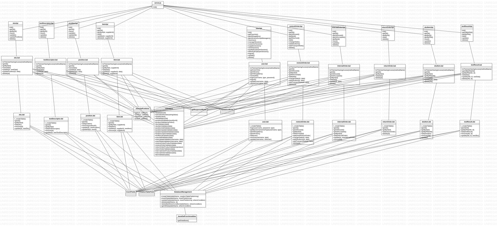

# Integration and API Test Report

Date: 25/05/2022

Version: 1.0

# Contents

- [Dependency graph](#dependency graph)

- [Integration approach](#integration)

- [Tests](#tests)

- [Scenarios](#scenarios)

- [Coverage of scenarios and FR](#scenario-coverage)
- [Coverage of non-functional requirements](#nfr-coverage)

# Dependency graph 

    
      
# Integration approach

Mixed    

#  Integration Tests

   <define below a table for each integration step. For each integration step report the group of classes under test, and the names of
     Jest test cases applied to them, and the mock ups used, if any> Jest test cases should be here code/server/unit_test

## Step 1
| Classes       | mock up used | Jest test cases         |
| ------------- | ------------ |:-----------------------:| 
| internalOrder |              | internalOrderDal.test   |
| position      |              | positionDal.test        |
| restockOrder  |              | restockOrderDal.test    |
| sku           |              | skuDal.test             |
| user          |              | userDal.test            |
| validators    |              | validators1Dal.test     |
| validators    |              | validators2Dal.test     |

## Step 2
| Classes        | mock up used | Jest test cases         |
| -------------- | ------------ |:-----------------------:| 
| internalOrder  |              | internalOrderDal.test   |
| position       |              | positionDal.test        |
| restockOrder   |              | restockOrderDal.test    |
| sku            |              | skuDal.test             |
| user           |              | userDal.test            |
| validators     |              | validators1Dal.test     |
| validators     |              | validators2Dal.test     |
| testDescriptor |              | testDescriptorDal.test  |
| returnOrder    |              | returnOrderDal.test     |
| skuItem        |              | skuItemDal.test         |

## Step 3 
| Classes        | mock up used | Jest test cases         |
| -------------- | ------------ |:-----------------------:| 
| internalOrder  |              | internalOrderDal.test   |
| position       |              | positionDal.test        |
| restockOrder   |              | restockOrderDal.test    |
| sku            |              | skuDal.test             |
| user           |              | userDal.test            |
| validators     |              | validators1Dal.test     |
| validators     |              | validators2Dal.test     |
| testDescriptor |              | testDescriptorDal.test  |
| returnOrder    |              | returnOrderDal.test     |
| skuItem        |              | skuItemDal.test         |
| item           |              | itemDal.test            |
| testResult     |              | testResultDal.test      |

# API testing - Scenarios

<If needed, define here additional scenarios for the application. Scenarios should be named
 referring the UC in the OfficialRequirements that they detail>

## Scenario UC1.1

| Scenario       |  Create SKU S |
| -------------- |:-------------:| 
| Precondition   | Manager M exists and is logged in |
| Post condition | S  into the system and with an assigned ID and a location  |
| Step#          | Description  |
|  1             | M sends body with new SKU to /api/sku/ |  
|  2             | M receives http code 201 |

## Scenario UC1.2

| Scenario |  Modify SKU location |
| ------------- |:-------------:| 
|  Precondition | Manager M exists and is logged in |
|               | SKU S exists |
|               | Position P is not assigned to any SKU |
|  Post condition     | S.position = P |
| Step#          | Description  |
|  1             | M sends request of body with id to /api/skus/:id |  
|  2             | M sends updated body with newPosition to /api/sku/:id |

## Scenario UC1.3

| Scenario |  Modify SKU weight and volume |
| ------------- |:-------------:| 
|  Precondition     | Manager M exists and is logged in |
|  | SKU S exists |
|  Post condition     | Weight and or volume of S updated |
| Step#          | Description  |
|  1             | M sends request of body with id to /api/skus/:id |  
|  2             | M sends updated body with newWeight and newVolume to /api/sku/:id |

## Scenario UC2.1

| Scenario |  Create position |
| ------------- |:-------------:| 
|  Precondition     | Manager M exists and is logged in |
|  Post condition     | Position P is created with zero occupied weight and volume |
| Step#          | Description  |
|  1             | M sends body with aisle ID, row, column, positionID, maxWeight, maxVolume to /api/position | 

## Scenario UC2.2

| Scenario |  Modify positionID of P |
| ------------- |:-------------:| 
|  Precondition     | Manager M exists and is logged in |
|         |Position P exists|
|  Post condition     | P's positionID updated |
| Step#          | Description  |
|  1             | M sends updated body with newPositionID to /api/position/:positionID/changeID |  

## Scenario UC2.3

| Scenario |  Modify weight and volume of P |
| ------------- |:-------------:| 
|  Precondition     | Manager M exists and is logged in |
||Position P exists|
|  Post condition     | P's weight and volume updated |
| Step#          | Description  |
|  1             | M sends updated body with newWeight, newVolume to /api/position/:positionID |  

## Scenario UC2.4

| Scenario |  Modify weight and volume of P |
| ------------- |:-------------:| 
|  Precondition     | Manager M exists and is logged in |
||Position P exists|
|  Post condition     | P's weight and volume updated |
| Step#          | Description  |
|  1             | M sends updated body with newWeight, newVolume to /api/position/:positionID |  

## Scenario UC2.5

| Scenario |  Delete position P |
| ------------- |:-------------:| 
|  Precondition     | Manager M exists and is logged in |
||Position P exists|
|  Post condition     | Position P deleted |
| Step#          | Description  |
|  1             | M sends id of position to be removed to /api/position/:positionID | 

<!-- Change1 deleteion of UC3.1
## Scenario UC3.1

| Scenario |  Restock Order of SKU S issued by quantity |
| ------------- |:-------------:| 
|  Precondition     | Manager M exists and is logged in |
| | SKU S exists |
|  Post condition     | Restock Order RO exists and is in ISSUED state  |
| | S.availability not changed |
| Step#        | Description  |
|  1             | M sends body with new restockOrder to /api/restockOrder |
|  2             | M receives http code 200 |
-->

## Scenario UC4.1

| Scenario |  Create user and define rights |
| ------------- |:-------------:| 
|  Precondition     | Admin A exists and is logged in |
|  Post condition     | Account X is created |
| Step#        | Description  |
|  1    |  A sends body with name, surname, email, type to /api/newUser |  
|  2    |  A receives http code 201 |

## Scenario UC4.2

| Scenario |  Modify user rights |
| ------------- |:-------------:| 
|  Precondition     | Admin A exists and is logged in |
|  | Account X exists |
|  Post condition     | X's rights updated |
| Step#        | Description  |
|  1    |  A sends updated body with oldType, newType to /api/users/:username |  
|  2    |  A receives http code 200 |

## Scenario UC4.3

| Scenario |  Delete user |
| ------------- |:-------------:| 
|  Precondition     | Admin A exists and is logged in |
|  | Account X exists |
|  Post condition     | Account X deleted |
| Step#        | Description  |
|  1    |  A sends body with email and type to /api/users/:username/:type |
|  2    |  A receives http code 204 |

## Scenario UC5.1.1

| Scenario |  Record restock order arrival  |
| ------------- |:-------------:| 
|  Precondition     | Clerk C exists and is logged in |
| | SKU S exists |
| | SKU position is valid |
| | Restock Order RO exists and is in DELIVERY state  |
|  Post condition     | RO is in DELIVERED  state  |
| | Each sku item has an RFID |
| Step#        | Description  |
| 1 | C sends body with SKUItems to /api/restockOrder/:id/skuItems |
| 2 | C sends body with newState to /api/restockOrder/:id |

## Scenario UC5.2.1

| Scenario |  Record positive test results of all SKU items of a RestockOrder |
| ------------- |:-------------:| 
|  Precondition  | Quality Employee Q exists and is logged in |
| | SKU S exists |
| | SKU position is valid |
| | Every SKU Item has an RFID attached |
| | Restock Order RO exists and is in DELIVERED state  |
|  Post condition     | RO is in TESTED state  |
| | Every SKU Item has a list of test results attached |
| Step#        | Description  |
| 1 | Q sends body of testResults to /api/skuitems/testResult |
| 2 | Q sends body with newState to /api/restockOrder/:id |

## Scenario UC5.2.2

| Scenario |  Record negative test results of all SKU items of a RestockOrder |
| ------------- |:-------------:| 
|  Precondition  | Quality Employee Q exists and is logged in |
| | SKU S exists |
| | SKU position is valid |
| | Every SKU Item has an RFID attached |
| | Restock Order RO exists and is in DELIVERED state  |
|  Post condition     | RO is in TESTED state  |
| | Every SKU Item has a list of test results attached |
| Step#        | Description  |
| 1 | Q sends body of testResults to /api/skuitems/testResult |
| 2 | Q sends body with newState to /api/restockOrder/:id |

## Scenario UC5.2.3

| Scenario |  Record negative test results of all SKU items of a RestockOrder |
| ------------- |:-------------:| 
|  Precondition  | Quality Employee Q exists and is logged in |
| | SKU S exists |
| | SKU position is valid |
| | Every SKU Item has an RFID attached |
| | Restock Order RO exists and is in DELIVERED state  |
|  Post condition     | RO is in TESTED state  |
| | Every SKU Item has a list of test results attached |
| Step#        | Description  |
| 1 | Q sends body of testResults to /api/skuitems/testResult |
| 2 | Q sends body with newState to /api/restockOrder/:id |

## Scenario UC5.3.1

| Scenario |  Stock all SKU items of a RO |
| ------------- |:-------------:| 
|  Precondition     | Clerk C exists and is logged in |
| | Every SKU Item has an RFID and a list of positive testResult attached |
| | SKU S exists |
| | SKU position is valid |
| | Restock Order RO exists and is in TESTED state  |
|  Post condition     | RO is in COMPLETED state  |
| Step#        | Description  |
| 1 | C sends body with newPosition to /api/sku/:id/position |
| 2 | C sends body with newAvailability to /api/skuitems/:rfid |
| 3 | C sends body with newState to /api/restockOrder/:id |

## Scenario UC5.3.2

| Scenario |  Stock zero SKU items of a RO |
| ------------- |:-------------:| 
|  Precondition     | Clerk C exists and is logged in |
| | Every SKU Item has an RFID and a list of negative testResult attached |
| | SKU S exists |
| | SKU position is valid |
| | Restock Order RO exists and is in TESTED state  |
|  Post condition     | RO is in COMPLETEDRETURN state  |
| Step#        | Description  |
| 1 | C sends body with newState to /api/restockOrder/:id |

## Scenario UC5.3.3

| Scenario |  Stock some SKU items of a RO |
| ------------- |:-------------:| 
|  Precondition     | Clerk C exists and is logged in |
| | Every SKU Item has an RFID and a list of positive and negative testResult attached |
| | SKU S exists |
| | SKU position is valid |
| | Restock Order RO exists and is in TESTED state  |
|  Post condition     | RO is in COMPLETEDRETURN state  |
| | S.units += RO.units |
| | P.volume -= RO.units * S.volume |
| | P.weight -= RO.units * S.weight |
| Step#        | Description  |
| 1 | C sends body with newPosition to /api/sku/:id/position |
| 2 | C sends body with newAvailability to /api/skuitems/:rfid |
| 3 | C sends body with newState to /api/restockOrder/:id |

## Scenario UC6.1

| Scenario |  Return order of SKU items that failed quality test |
| ------------- |:-------------:| 
|  Precondition     | Manager M exists and is logged in |
| | SKU S exists |
| | Restock order RO exists and is in state = COMPLETEDRETURN |
| | Restock order RO has at least N units of S that not passed quality tests, N>0 |
|  Post condition     | Return Order REO registered into system  |
| | Every SKU item returned is not available |
| Step#        | Description  |
| 1 | M sends request with returnOrderId to /api/returnOrders/:id |
| 2 | M receives body with returnOrder |
| 3 | M sends request to /api/skuitems/:rfid with every rfid not passed of products of returnOrder |
| 4 | M sends body with newAvailable to /api/skuitems/:rfid |

## Scenario UC6.2

| Scenario |  Return order of any SKU items |
| ------------- |:-------------:| 
|  Precondition     | Manager M exists and is logged in |
| | SKU S exists |
| | Restock order RO exists and is in state = COMPLETEDRETURN |
| | Restock order RO has at least 1 units of S that passed quality tests and need to be returned anyway |
|  Post condition     | Return Order REO registered into system  |
| | RFID for every SKU item returned is deleted |
| | Availability of sku and of position updated |
| Step#        | Description  |
| 1 | M sends request with returnOrderId to /api/returnOrders/:id |
| 2 | M receives body with returnOrder |
| 3 | M sends request to /api/skuitems/:rfid with every rfid of products of returnOrder |
| 4 | M sends body with newAvailable to /api/skuitems/:rfid |

## Scenario UC9.1 

| Scenario |  Internal Order IO accepted |
| ------------- |:-------------:| 
|  Precondition     | Customer C exists and is logged in |
|   | Manager M exists and is logged in |
| | SKUs exists and have enough units to complete the order |
|  Post condition     | For each SKU ordered: S.availability -= N |
|| IO in state = ACCEPTED|
|| Availability of SKU decreases |
| | Availability of Position increases |
| Step#        | Description  |
| 1 | C sends a body with issueDate, products, customerId to /api/internalOrders |
| 2 | M accepts the IO send body with newState to /api/internalOrders/:id|

## Scenario UC9.2 

| Scenario |  Internal Order IO accepted |
| ------------- |:-------------:| 
|  Precondition     | Customer C exists and is logged in |
|   | Manager M exists and is logged in |
| | SKUs exists and have enough units to complete the order |
|  Post condition     | For each SKU ordered: S.availability -= N |
|| IO in state = ACCEPTED|
|| Availability of SKU decreases |
| | Availability of Position increases |
| Step#        | Description  |
| 1 | C sends a body with issueDate, products, customerId to /api/internalOrders |
| 2 | M refuses the IO send body with newState to /api/internalOrders/:id|

## Scenario UC9.3

| Scenario |  Internal Order IO cancelled |
| ------------- |:-------------:| 
|  Precondition     | Customer C exists and is logged in |
| | SKUs exists and have enough units to complete the order |
| Post condition  | IO in state = CANCELLED |
| Step#        | Description  |
| 1 | C sends a body with issueDate, products, customerId to /api/internalOrders |
| 2 | System cancels the IO send body with newState to /api/internalOrders/:id|

## Scenario UC10.1 

| Scenario |  Internal Order IO Completed |
| ------------- |:-------------:| 
|  Precondition     | Delivery Employee D exists and is logged in |
|   | Internal Order IO exists and State = ACCEPTED |
| | Position P exists |
|  Post condition     | IO in state = COMPLETED  |
| | SKU Items delivered setted as not available from the system |
| Step#        | Description  |
| 1 | D gets all rfids of items to be delivered from /api/internalOrders/:id |
| 2 | M sends body with newAvailable to /api/skuitems/:rfid |
| 3 | System updates the IO sending body with newState to /api/internalOrders/:id|

## Scenario UC11.1

| Scenario |  Create Item I |
| ------------- |:-------------:| 
|  Precondition     | Supplier S exists and is logged in |
|  Post condition     | I into the system and with an assigned ID  |
| Step#        | Description  |
| 1 | S sends body with id, description, price SKUId, supplierId to /api/item|
| 2 | S receives http code 201 |

## Scenario UC11.2

| Scenario |  Modify Item description and price |
| ------------- |:-------------:| 
|  Precondition     | Supplier S exists and is logged in |
|  | Item I exists |
|  Post condition     | Description and or price of I updated |
| Step#        | Description  |
| 1 | S sends body with newDescription and newPrice to /api/item/:id |
| 2 | S receives http code 200 |

## Scenario UC12.1

| Scenario |  Create test description |
| ------------- |:-------------:| 
|  Precondition     | Manager M exists and is logged in |
| | SKU S exists |
|  Post condition     | Test description is created |
| Step#        | Description  |
| 1 | M sends body with name, procedureDescription, idSKU to /api/testDescriptor |
| 2 | M receives http code 201 |

## Scenario UC12.2

| Scenario |  Update test description |
| ------------- |:-------------:| 
|  Precondition     | Manager M exists and is logged in |
| | SKU S exists |
|  Post condition     | Test description is created |
| Step#        | Description  |
| 1 | M sends body with newName, newProcedureDescription, newIdSKU to /api/testDescriptor/:id |
| 2 | M receives http code 200 |

## Scenario UC12.3

| Scenario |  Delete test description |
| ------------- |:-------------:| 
|  Precondition     | Manager M exists and is logged in |
| | SKU S exists |
|  Post condition     | Test description is created |
| Step#        | Description  |
| 1 | M sends with id to /api/testDescriptor/:id |
| 2 | M receives http code 204 |

# Coverage of Scenarios and FR

<Report in the following table the coverage of  scenarios (from official requirements and from above) vs FR. 
Report also for each of the scenarios the (one or more) API Mocha tests that cover it. >  Mocha test cases should be here code/server/test

| Scenario ID | Functional Requirements covered | Mocha  Test(s) | 
| ----------- | ------------------------------- | ----------- | 
|  1.1         | FR2.1                             |  sku.api.save           |             
|  1.2         | FR2.1                             |  sku.api.updatePosition           |             
|  1.3         | FR2.1                             |  sku.api.update           |             
|  2.1         | FR3.1.1                                |  position.api.save           |             
|  2.2         | FR3.1.1                                |  position.api.updateId           |             
|  2.3         | FR3.1.4                                | position.api.update            |    
|  2.4         | FR3.1.4                                |  position.api.update           |             
|  2.5         | FR3.1.2                               |  position.api.delete           | 
<!--|  3.1         | FR5.6                                |  restockOrder.api.add           |-->
|  4.1         | FR1.1                                | user.api.newUser            |
|  4.2         | FR1.1                                | user.api.update            |
|  4.3         | FR1.2                               |  user.api.delete           |
|  5.1.1         |  FR5.7 FR5.8.1                              |  restockOrder.api.changeState skuItem.api.save         |
|  5.2.1         |  FR5.7 FR5.8.2                               | restockOrder.api.changeState testResults.api.save          |
|  5.2.2         |  FR5.7 FR5.8.2                               | restockOrder.api.changeState  testResults.api.save            |
|  5.2.3         |  FR5.7 FR5.8.2                               | restockOrder.api.changeState  testResults.api.save            |
|  5.3.1         |  FR5.7 FR5.8.3                               | restockOrder.api.changeState  position.api.update            |
|  5.3.2         |  FR5.7                               |  restockOrder.api.changeState           |
|  5.3.3         |  FR5.8.1                               |  restockOrder.api.changeState  position.api.update           |
|  6.1         |  FR5.10                               |  returnOrder.api.add           |
|  6.2         |  FR5.11                               |  returnOrder.api.add           |
|  9.1         |  FR6.6 FR6.7                              | internalOrder.api.add position.api.update sku.api.update          |
|  9.2         |  FR6.6 FR6.7                              |  internalOrder.api.update           |
|  9.3         |  FR6.6 FR6.7                              | internalOrder.api.update            |
|  10.1         |  FR6.7                               | internalOrder.api.update skuItem.api.update          |
|  11.1         |  FR7                               | item.api.add           |
|  11.2         |  FR7                               |  item.api.update           |
|  12.1         |  FR3.2.1                               | testDescriptor.api.save            |
|  12.2         |  FR3.2.2                               | testDescriptor.api.update            |
|  12.3         |  FR3.2.3                               | testDescriptor.api.delete            |            

# Coverage of Non Functional Requirements

<Report in the following table the coverage of the Non Functional Requirements of the application - only those that can be tested with automated testing frameworks.>

### 

| Non Functional Requirement | Test name |
| -------------------------- | --------- |
| NFR4                       | ApiTest: testPositionApi.js UnitTest: validators1.test.js (testPositionIdValidator)     |
| NFR6                       | ApiTest: testSkuItemApi.js UnitTest: validators1.test.js (testRfidValidator)        |
| NFR7                       | ApiTest: testPositionApi.js UnitTest: validators1.test.js (testPositionValidator)        |
| NFR8                       | ApiTest: testPositionApi.js UnitTest: validators1.test.js (testPositionValidator)        |
| NFR9                       | ApiTests: testSkuItemApi.js, testTestResult.js, testInternalOrders.js, testReturnOrder.js, testRestockOrder.js UnitTests: validators1.test.js (testIsDate)        |
