# Design Document 

Authors: Group 33

Date: 27/04/2022

Version: 1.0

# Contents

- [High level design](#package-diagram)
- [Low level design](#class-diagram)
- [Verification traceability matrix](#verification-traceability-matrix)
- [Verification sequence diagrams](#verification-sequence-diagrams)

# Instructions

The design must satisfy the Official Requirements document, notably functional and non functional requirements, and be consistent with the APIs 

# High level design 

<discuss architectural styles used, if any>
<report package diagram, if needed>

Architecture:

- EZWh is a stand-alone application.

Architectural patterns:

- MVC (with the V on the frontend and the MC on the backend)
- layered - 3 tiered

The three layers are:

- Presentation Logic
- BAL: Business Access Layer
- DAL: Data Access Layer

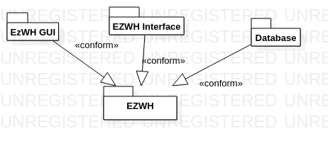

# Low level design

<for each package in high level design, report class diagram. Each class should detail attributes and operations>

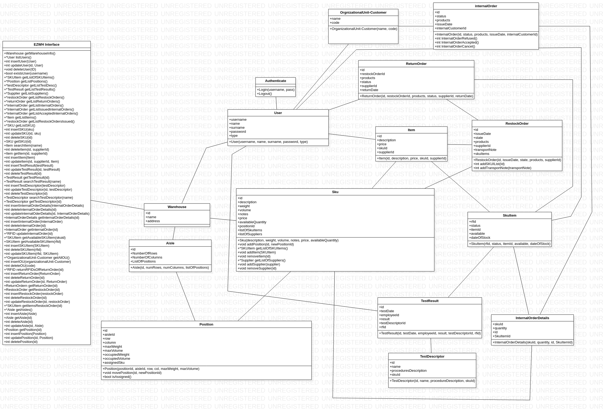

# Verification traceability matrix

\<for each functional requirement from the requirement document, list which classes concur to implement it>

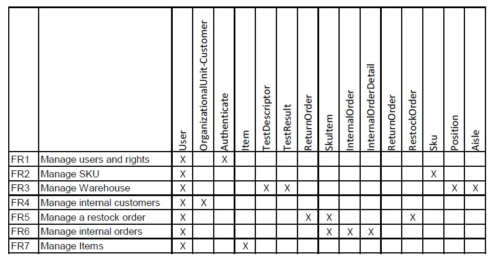

# Verification sequence diagrams 
\<select key scenarios from the requirement document. For each of them define a sequence diagram showing that the scenario can be implemented by the classes and methods in the design>

Sequence Diagram for Scenarios 1-2:

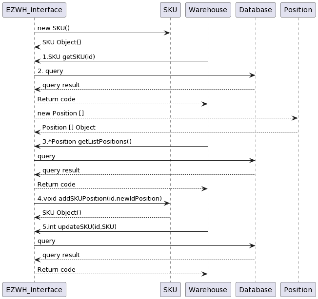

Sequence Diagram for Scenarios 2-1:

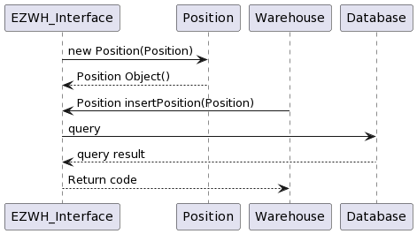

Sequence Diagram for Scenarios 4-1:

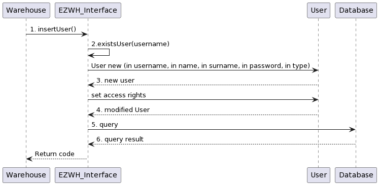

Sequence Diagram for Scenarios 5-2-1:

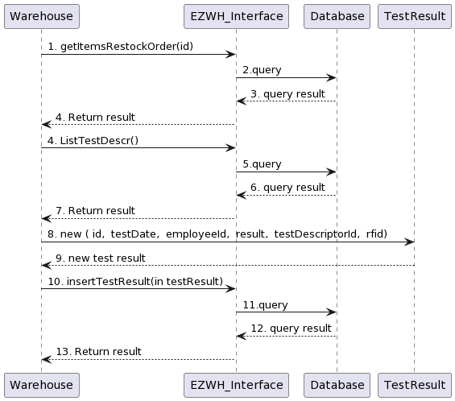

Sequence Diagram for Scenarios 6-2:

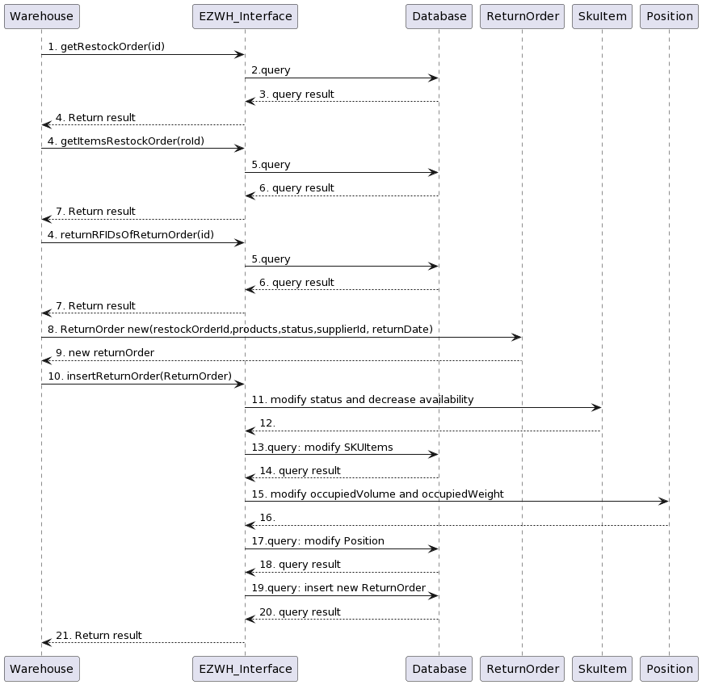

Sequence Diagram for Scenarios 9-1:

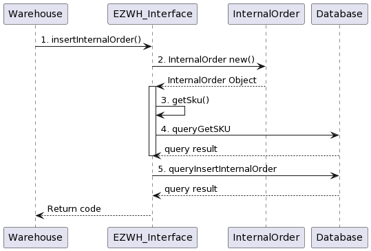

Sequence Diagram for Scenarios 11-1:

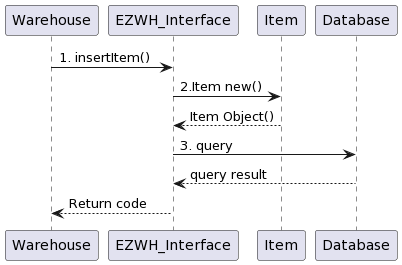

Sequence Diagram for Scenarios 12-1:

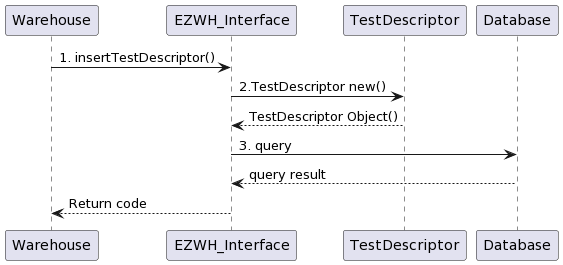

