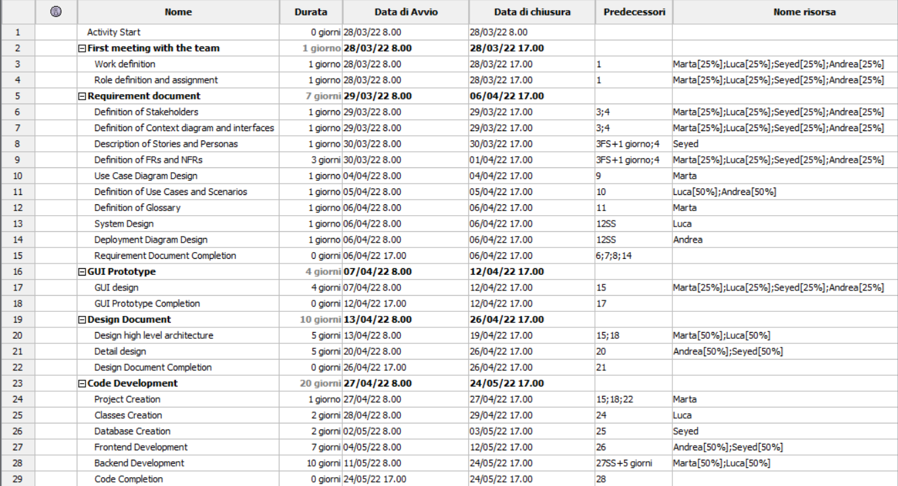
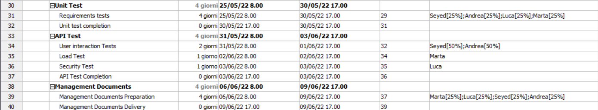
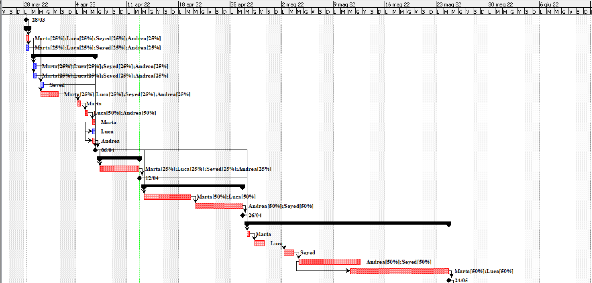
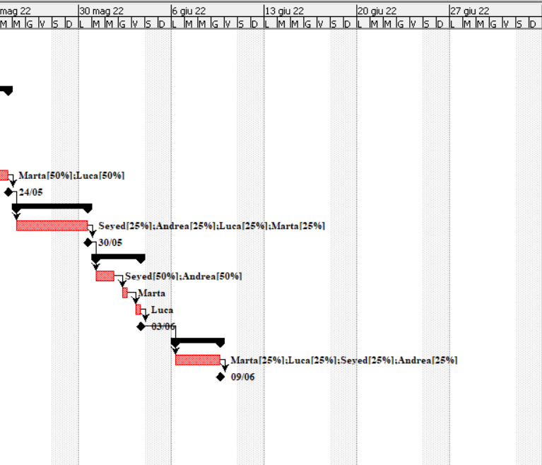

# Project Estimation  

Date: 13/04/2022

Version:1.0

# Estimation approach
Consider the EZWH  project as described in YOUR requirement document, assume that you are going to develop the project INDEPENDENT of the deadlines of the course
# Estimate by size
### 
|             | Estimate                        |             
| ----------- | ------------------------------- |  
| NC =  Estimated number of classes to be developed   |55                             |             
|  A = Estimated average size per class, in LOC       |240                           | 
| S = Estimated size of project, in LOC (= NC * A) |13200 |
| E = Estimated effort, in person hours (here use productivity 10 LOC per person hour)  |1320                                     |   
| C = Estimated cost, in euro (here use 1 person hour cost = 30 euro) |39600 | 
| Estimated calendar time, in calendar weeks (Assume team of 4 people, 8 hours per day, 5 days per week ) |8.25                   |               

# Estimate by product decomposition
### 
|         component name    | Estimated effort (person hours)   |             
| ----------- | ------------------------------- | 
|requirement document    |80ph |
| GUI prototype |50ph|
|design document |60ph|
|code |740ph|
| unit tests |45ph|
| api tests |25ph|
| management documents  |40ph|

# Estimate by activity decomposition
### 
|         Activity name    | Estimated effort (person hours)   |             
| ----------- | ------------------------------- | 
| First meetings with the team | 16ph |
| Requirement document | 88ph |
| GUI Prototype | 32ph |
| Design Document | 67ph|
| Code Development | 704ph |
| Unit Test | 128ph |
| API Test | 128ph |
| Management Documents | 32ph |
	

###
 Despite of dividing works between members of the group all members are work concurrently on the project.

# Summary

|             | Estimated effort                        |   Estimated duration |          
| ----------- | ------------------------------- | ---------------|
| estimate by size |1320|42 working days|
| estimate by product decomposition |1040| 32 working days
| estimate by activity decomposition |1195|38 working days

In each approach of estimation, different thing is the base source of estimation these differences cause the dissimilarities in "Estimated effort" and "Estimated duration".
