# Graphical User Interface Prototype  

<<<<<<< HEAD
Authors:

Date:

Version:

\<Report here the GUI that you propose. You are free to organize it as you prefer. A suggested presentation matches the Use cases and scenarios defined in the Requirement document. The GUI can be shown as a sequence of graphical files (jpg, png)  >

=======
Authors: Group 33

Date: 12/04/2022

Version: 1.0

1. Login – Unique login page for all the user. First page when you open the application.

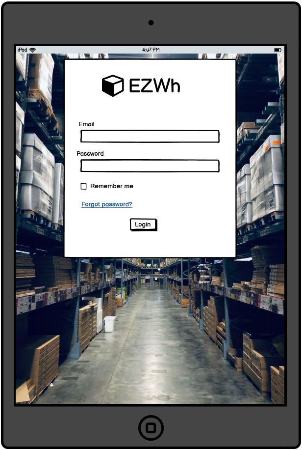

2. Forgot Password – Allows password Reset, when forgotten, using phone number.

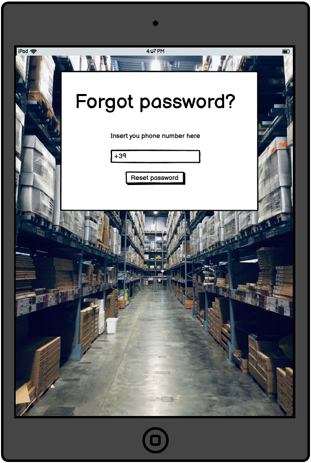

3. Reset Password – Enter OTP Code received on phone number and a new Password for reset

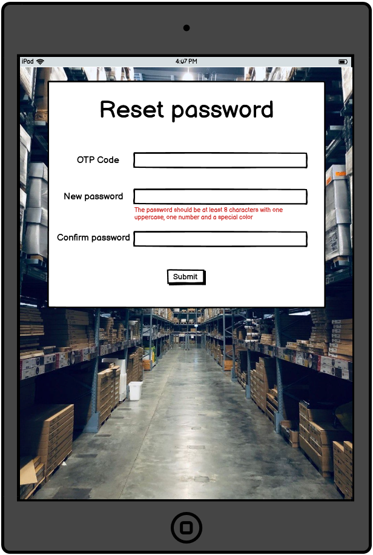

4.	Manager Main Page – Manager can see al the orders list. Each order can be in three different states: Delivered (when item has already been delivered), Processing (when the order is waiting for the supplier to insert the price), Ready For Payment (when manager has to pay for the price sent by the supplier or to cancel the order) and In Travel (when an order has been paid and the item is in travel)

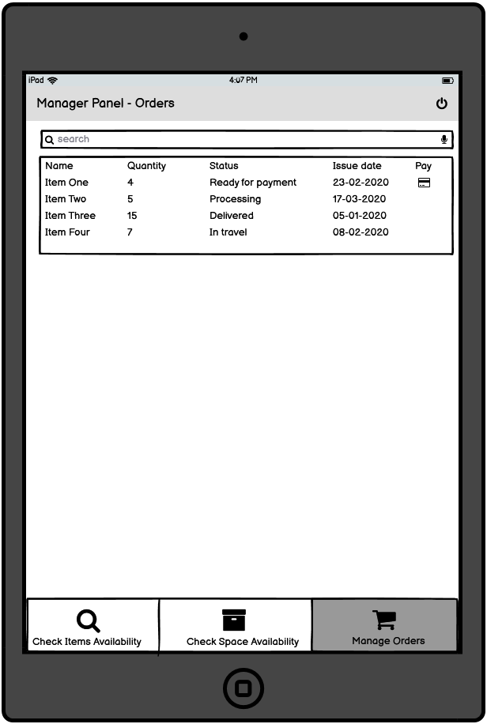

5.	Pay for the Order – Manager can complete the order, paying for the price that supplier has sent, or rejecting the order if the price received is not acceptable

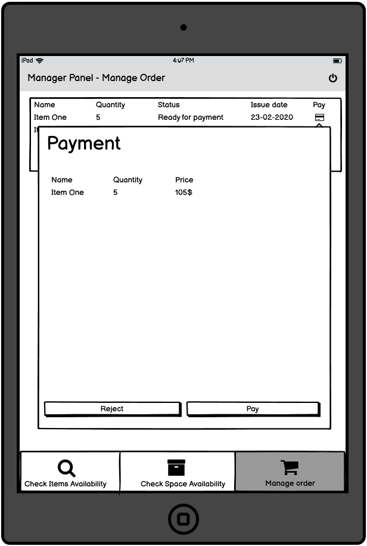

6.	Availability of Space – Manager can see the number of free spaces in the warehouse

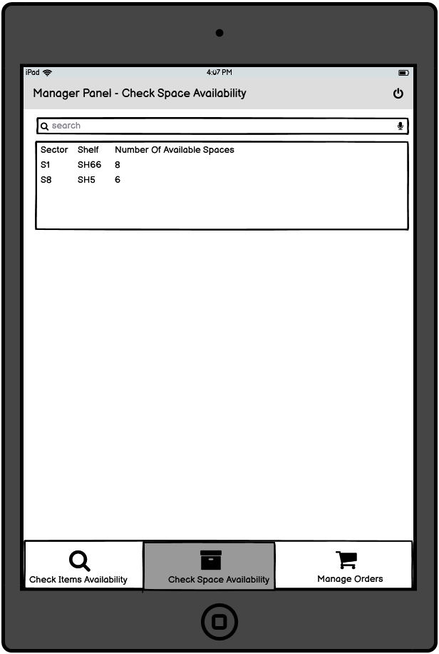

7.	Check Items Availability – Manager can see the list of items and their quantity and position inside the warehouse. Can order more of one item or buy a completely new item never bought before.

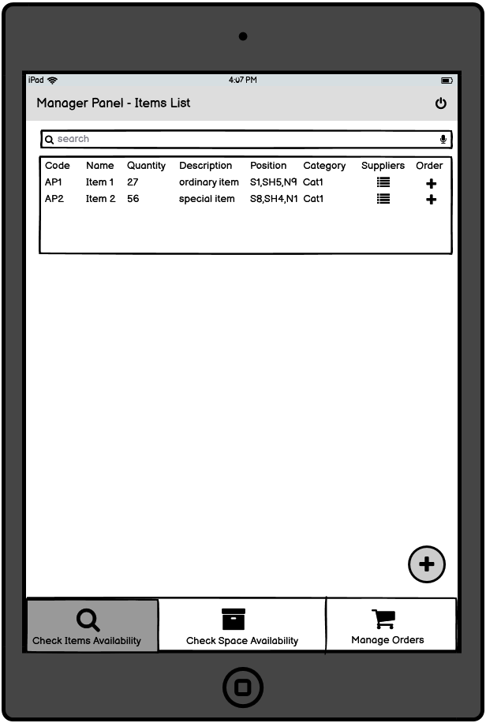

8.	Issue Order for a new Item – By pressing on the right bottom plus button in screen 7, manager can insert Name, Description, Category and quantity of the new item needed. He have also to insert the information about the supplier (Name, E-Mail and Phone Number) for the first purchase, this information will be saved, for ordering more of that item, when needed. By pressing on “Send the Order” button, the application will send an E-Mail to the supplier with the request of the price to pay for that order.07.Check_Items_Availablity

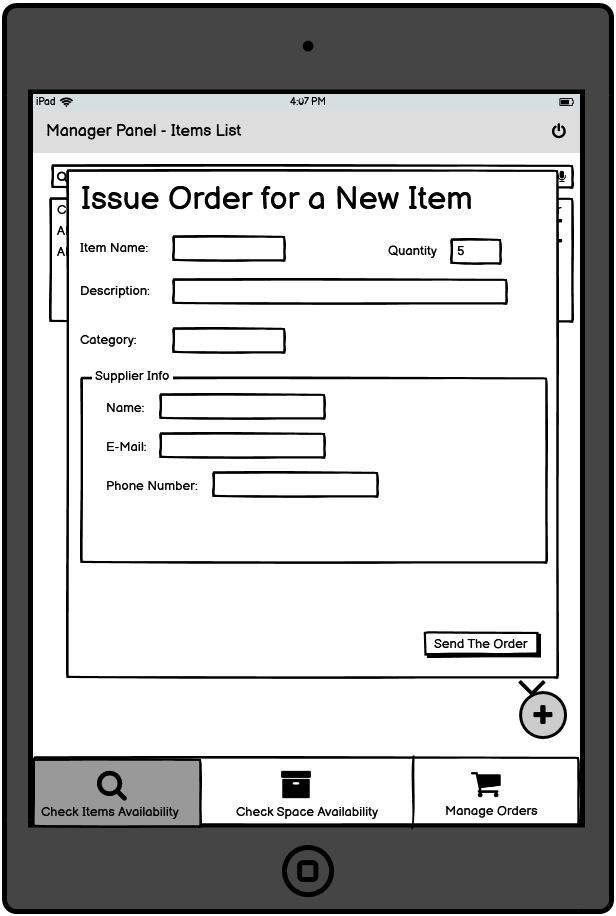

9.	List of Suppliers – By pressing on the supplier list button of an item row,  manager can see the list of the inserted Suppliers that sell that item. Manager can add a new Supplier from which retrieving that item (by pressing on the plus button), edit an existing Supplier (by pressing on the pencil button) or deleting an existing supplier (by pressing on the cross button). Manager can buy more item, from one specific Supplier, by pressing on the plus button in the corresponding column “Order”.

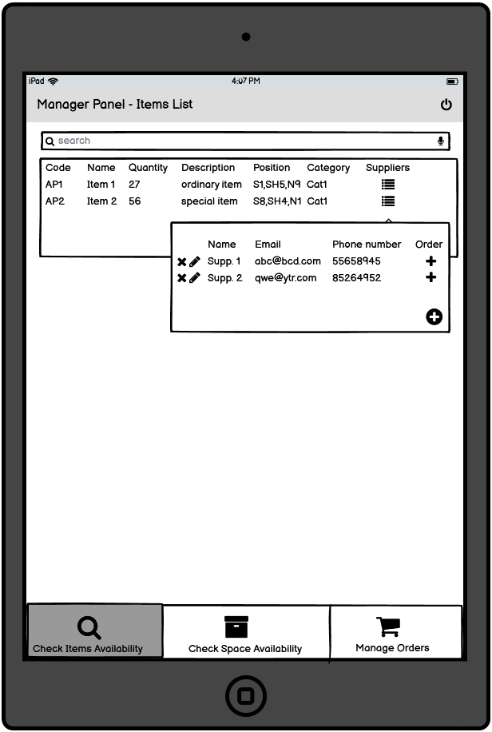

10.	When Manager wants to delete a Supplier for one specific Item, a message pops up asking to confirm the deletion.

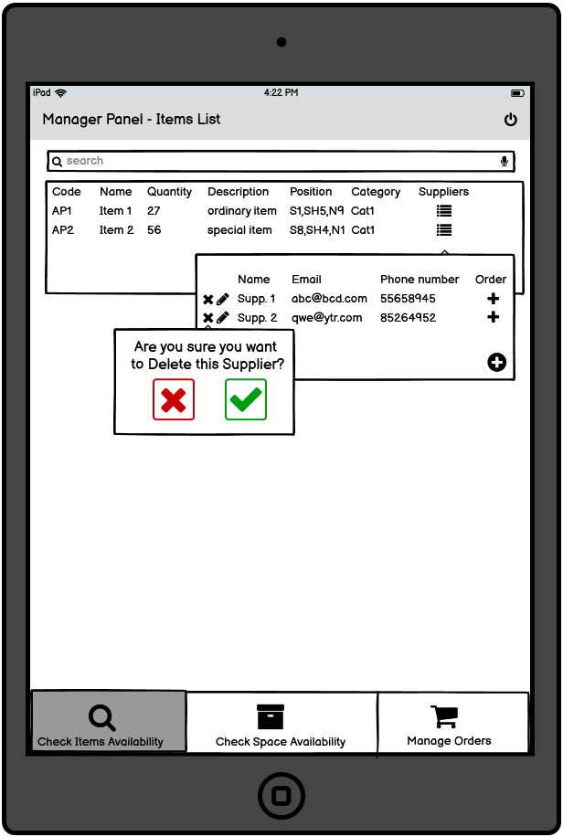

11.	When manager wants to edit a Supplier, a windows pops up and the manager can modify the existing values and apply changes pressing the “Edit” Button.

12.	Issue Order for an existing Item – By pressing on the order plus button in the Suppliers list of an item, that has already been bought, at least once, before. Manager can select quantity, of the needed item , to order to the Supplier, send the order, by pressing the “Issue Order” button , and waiting for him to send back the price.

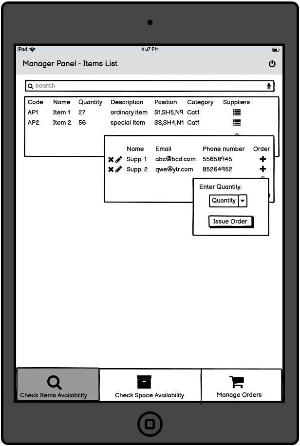

13.	Supplier access to this page from a link, in the E-Mail sent by the system, to insert the price at which he wants to sell the indicated item, and send back the information to the manager by pressing the button “Send Price”.

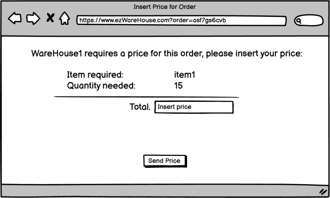

14.	Administrator Main Page – First page when Administrator log in, it shows the list of all the registered users. Administrator is able to: search for an user by name, deleting a user by pressing on the relative corresponding cancel button, editing a user by pressing on the corresponding pencil button and finally adding a new user by pressing on the relative bottom right plus button.

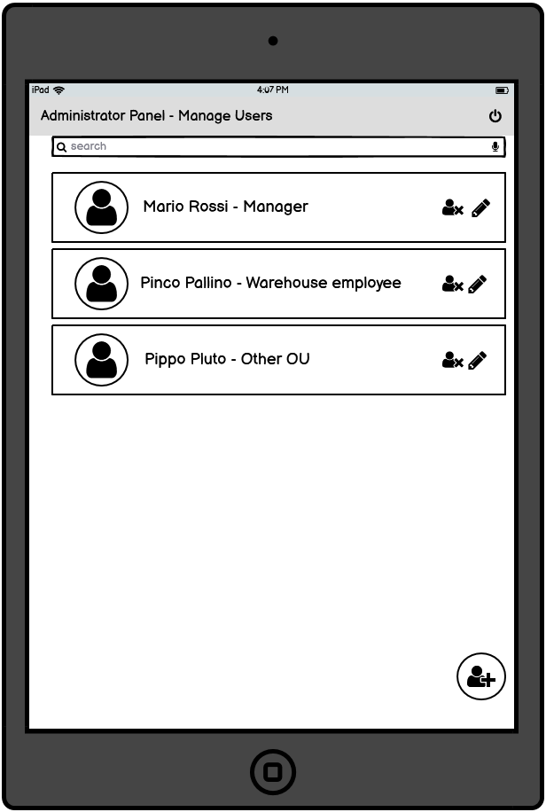

15.	Create User – Administrator can insert all the information associated to a warehouse worker and creating him an user for the system.

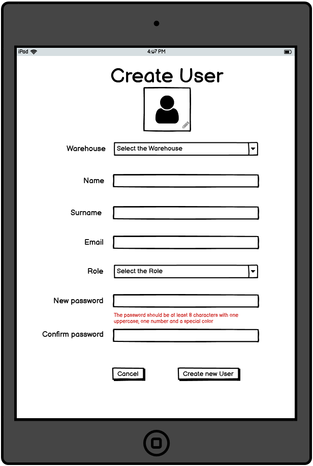

16.	Deleting User - When want to delete a user by pressing on the coring icon, a message pops up and ask for confirmation of the operation.

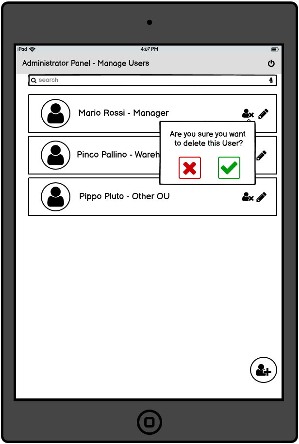

17.	Edit User – Administrator can change personal information of the user and modify worker’s role inside the warehouse.

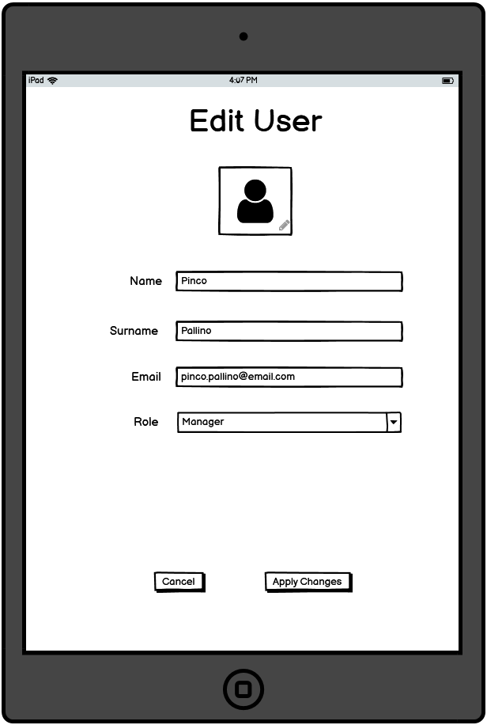

18.	Quality Office Main Page – First page when a user with “quality office” role log in, he can see the list of the items, randomly selected from the one delivered by suppliers, that have to be tested. The Quality Office worker can approve or reject an item, by press the corresponding buttons, in base of the tests done.

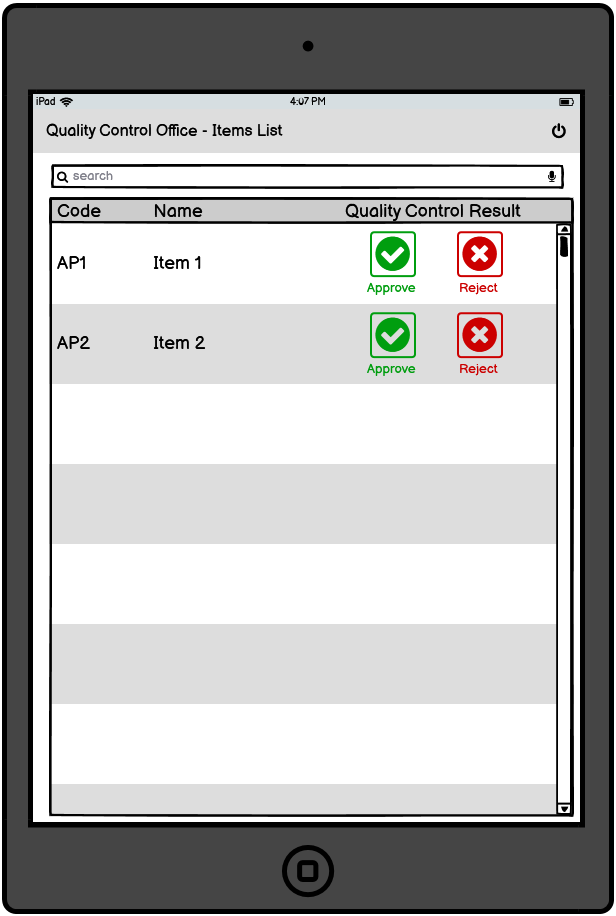

19.	Other Organizational Units Main Page – Other Units of the same company access this page when log in. A Unit can see the list of items ordered to the warehouse, an order can be in three different status: “Processing” (when Warehouse user is still collecting the items of the order), “Ready for Pick Up” (when items has been sent to the pick up area where the other organizational unit can come to take) and “Collected” (when the other organizational unit has collected their internal order from the pick up area). From this page an Organizational Unit can collect an internal order, from the Pick Up Area, when it is “Ready For Pick Up” and signing it as “Collected”, closing in this way the internal order, by pressing the corresponding “Collect” button. From this page it can also request a new internal order by pressing on the bottom right plus button.

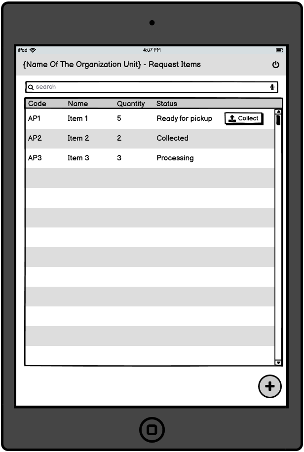

20.	Collect Internal Order – when pressing on the “Collect” button of an order that is in status “Ready for Pick Up”, a message pops up, asking for confirmation: if confirmed the order is signed as “Collected” status.

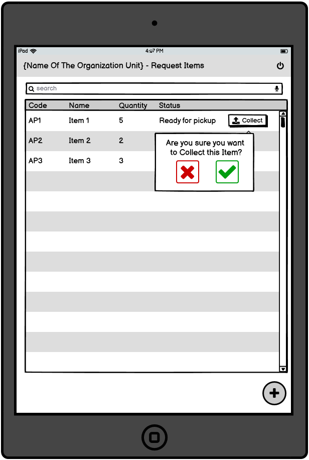

21.	Request Items – Other Organizational Unit wants to request an item, select the quantity and send the order to the warehouse.

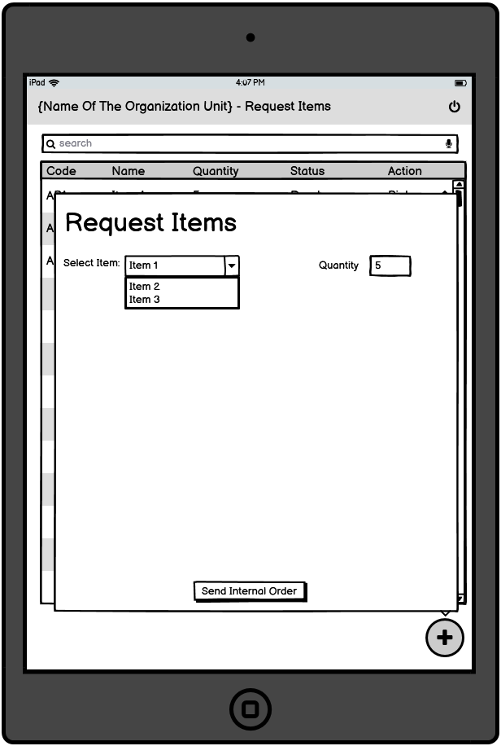

22.	Warehouse User Main Page – Default page shown to the Warehouse Users that have logged in. It shows the list of all the items stored in the warehouse with their position, so that the warehouse user can keep track of where each item is positioned. From this page he can: search for one item, edit an item (changing item information, quantity and position) by pressing on the corresponding pencil button, delete an item from the warehouse by pressing on the corresponding trash button and add a new item by pressing on the bottom right plus button.

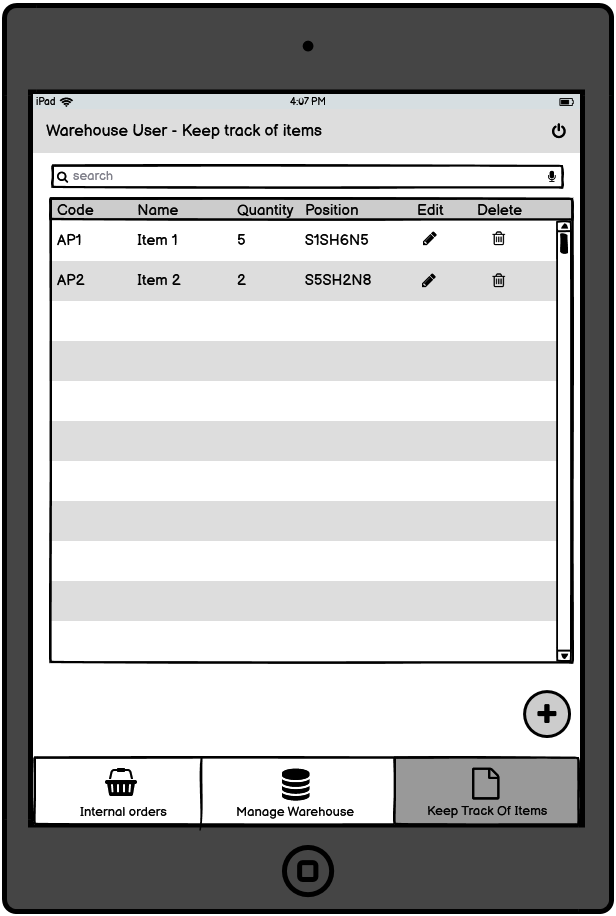

23.	Add new item – Warehouse user inserts all new item information (name, description, category) by hand, after that he inserts the quantity and the position where it has been stored (Sector number, Shelf number and Partition number).

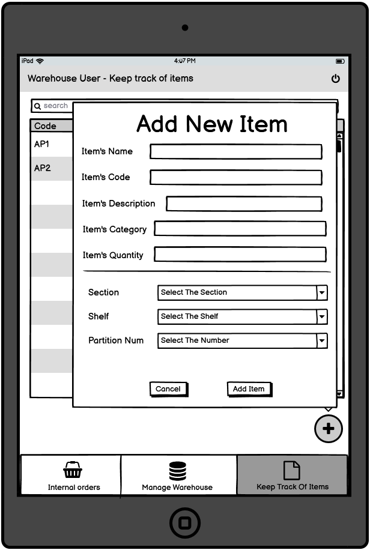

24.	Edit Item – A warehouse user can edit an item modifying its information (name, description, category), the quantity that is present in the warehouse or the position in the warehouse and then apply the changes by pressing the “Edit” button.

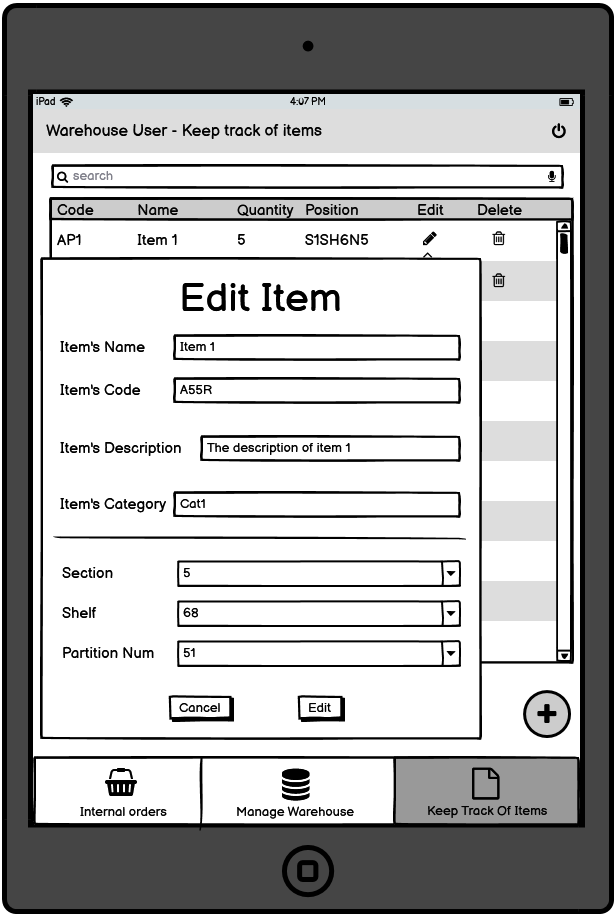

25.	Delete Item – A warehouse user can delete an item from the warehouse, when he press on the corresponding button, a message pops up asking for confirmation for the operation.

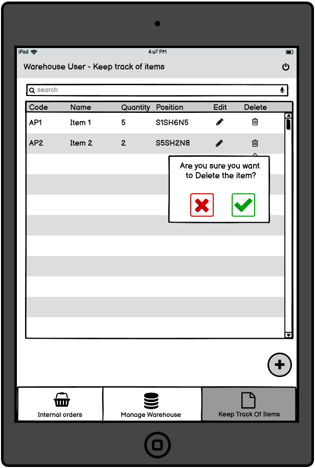

26.	Manage Internal Order: Warehouse User can see the list of the internal order received by the warehouse.

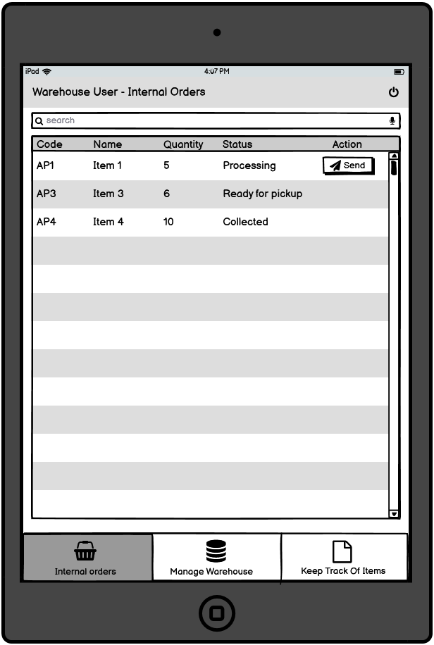

27.	Change Internal Order Status: when a warehouse user has retrieved all the items required in an internal order, he sends them to the pick up area and signs it as “Ready To Pick Up” by pressing on the “Send” button, on press a message pops up asking to confirm the operation.

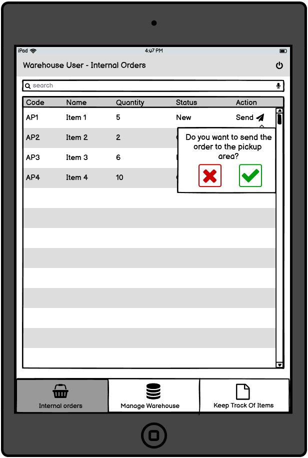

28.	Manage Warehouse – A Warehouse User can see the list of all sectors of the warehouse, can do a research by sector name, can edit a sector information by pressing on the corresponding pencil button, can delete a sector by pressing on the corresponding trash button and can add a sector by pressing on the bottom right plus button.

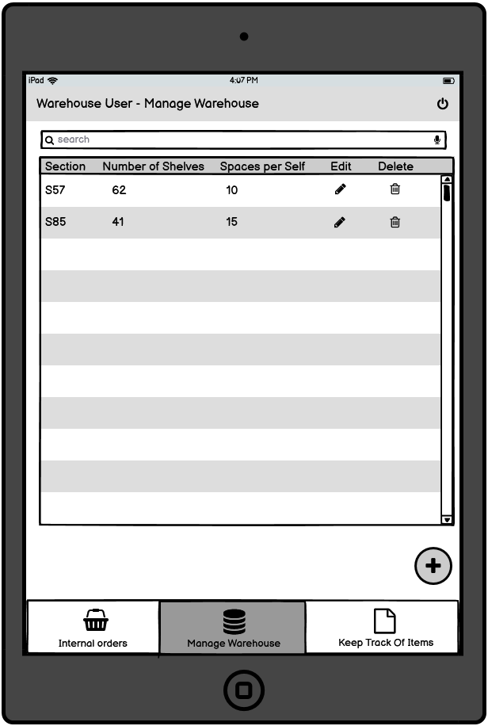

29.	Add Sector – A Warehouse can create a sector, ha has to insert the sector name, the number of shelves in the sector and the number of spaces on each shelf; then he creates the sector by pressing on the “Add Sector” button.

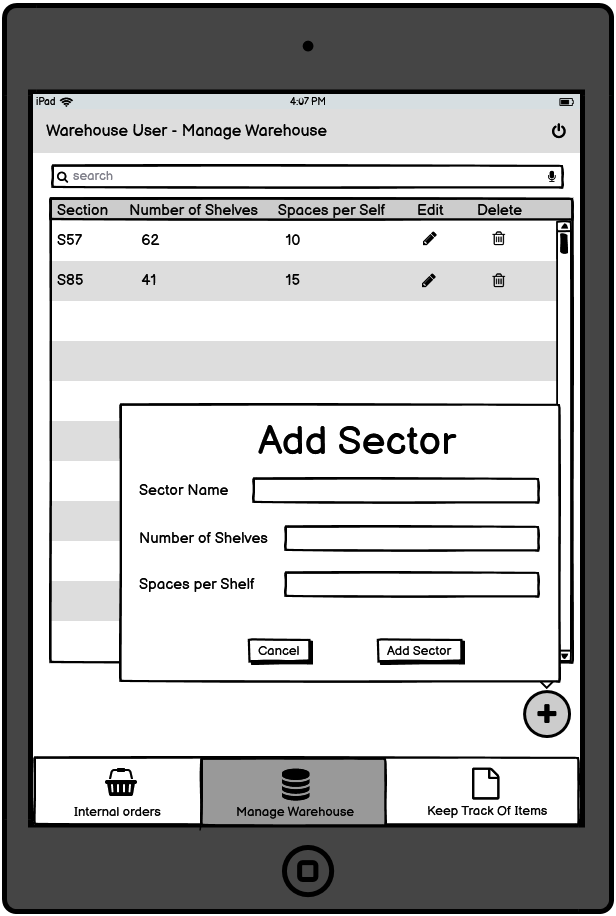

30.	Edit Sector – A warehouse user can edit an already existing sector by pressing on the corresponding pencil button, then he can modify the parameters of the sector and confirm the changes by pressing on the “Edit Sector” button.

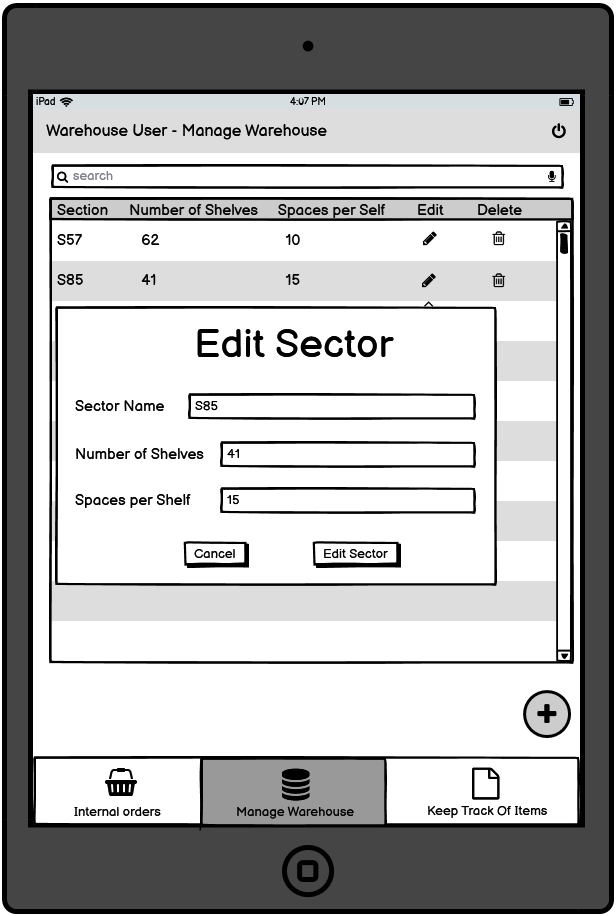

31.	Delete Sector – A warehouse user can delete a sector by pressing on the corresponding trash button, on press a message pops up asking to confirm deletion.

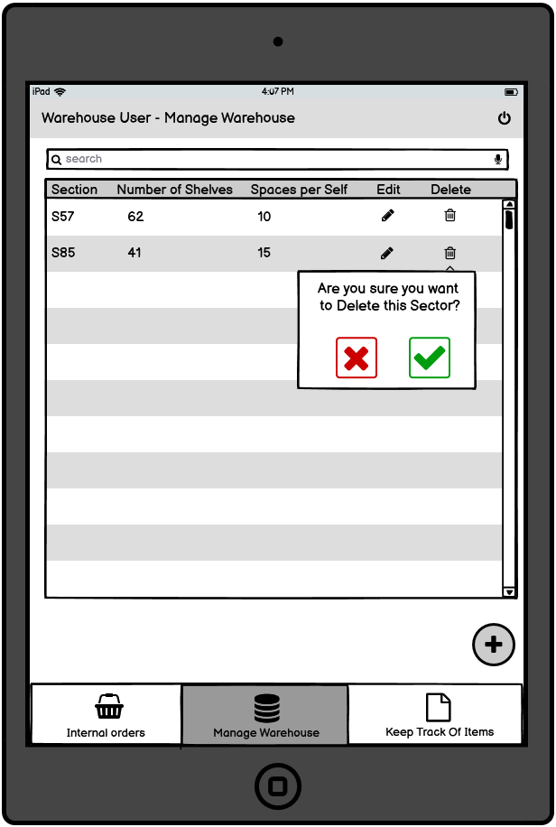
>>>>>>> s296185-master-patch-23748
