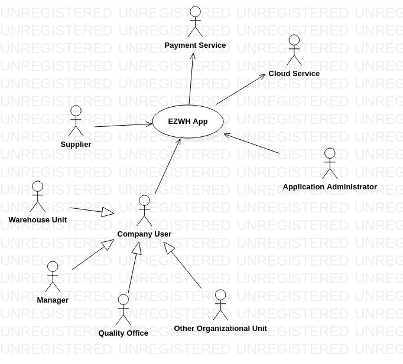

 # Requirements Document 

Date: 22 march 2022

Version: 1.11

 
| Version number | Change |
| --- |:-----------------------------------|
| 1.0 | Adding Stakeholders			   	   |
| 1.1 | Adding Actors 		        	   |
| 1.2 | Adding Context Diagram             |
| 1.3 | Adding Actors Interfaces           |
| 1.4 | Adding Functional Requirements     |
| 1.5 | Adding Non Functional Requirements |
| 1.6 | Adding Use Case Diagram            |
| 1.7 | Adding Manage internal orders's Use Case|
| 1.8 | Adding Deployment Diagram          |
| 1.9 | Adding Manage WareHouse, Quality Check  Use Cases        |
| 1.10 | Adding System Design              |
| 1.11 | Adding Glossary                   |

# Contents

- [Informal description](#informal-description)
- [Stakeholders](#stakeholders)
- [Context Diagram and interfaces](#context-diagram-and-interfaces)
	+ [Context Diagram](#context-diagram)
	+ [Interfaces](#interfaces) 
	
- [Stories and personas](#stories-and-personas)
- [Functional and non functional requirements](#functional-and-non-functional-requirements)
	+ [Functional Requirements](#functional-requirements)
	+ [Non functional requirements](#non-functional-requirements)
- [Use case diagram and use cases](#use-case-diagram-and-use-cases)
	+ [Use case diagram](#use-case-diagram)
	+ [Use cases](#use-cases)
    	+ [Relevant scenarios](#relevant-scenarios)
- [Glossary](#glossary)
- [System design](#system-design)
- [Deployment diagram](#deployment-diagram)

# Informal description
Medium companies and retailers need a simple application to manage the relationship with suppliers and the inventory of physical items stocked in a physical warehouse. 
The warehouse is supervised by a manager, who supervises the availability of items. When a certain item is in short supply, the manager issues an order to a supplier. In general the same item can be purchased by many suppliers. The warehouse keeps a list of possible suppliers per item. 

After some time the items ordered to a supplier are received. The items must be quality checked and stored in specific positions in the warehouse. The quality check is performed by specific roles (quality office), who apply specific tests for item (different items are tested differently). Possibly the tests are not made at all, or made randomly on some of the items received. If an item does not pass a quality test it may be rejected and sent back to the supplier. 

Storage of items in the warehouse must take into account the availability of physical space in the warehouse. Further the position of items must be traced to guide later recollection of them.

The warehouse is part of a company. Other organizational units (OU) of the company may ask for items in the warehouse. This is implemented via internal orders, received by the warehouse. Upon reception of an internal order the warehouse must collect the requested item(s), prepare them and deliver them to a pick up area. When the item is collected by the other OU the internal order is completed. 

EZWH (EaSy WareHouse) is a software application to support the management of a warehouse.

# Stakeholders

| Stakeholder name  | Description | 
| ------------------------- |:-----------------------------------------------------------------------:|
| Suppliers                 | Ones who deliver lacking items										  |
| Manager                   | Person who supervises the availability of items 						  |
| Quality Office            | Office that checks items quality                                        |
| Other Organizational Unit | Other factory of the same company which asks for items to the warehouse |
| Warehouse Unit            | Manage physical space in the warehouse                                  |
| System Administrator      | Person who manages the app 											  |
| Payment Service           | Service to manage payments between suppliers and the company 			  |
| App Store                 | Store to share the application 										  |
| Cloud Service             | Service for storing data about the warehouse 							  |
| Competitors               | Other software house 													  |
| Project Financers         | Medium companies and retailers which only gives money 				  |

# Context Diagram and interfaces

## Context Diagram

## Interfaces
<!--\<describe here each interface in the context diagram>

\<GUIs will be described graphically in a separate document> -->

| Actor 		  | Logical Interface		| Physical Interface  |
| --------------- |:-----------------------:| -------------------:|
| User			  | GUIs of the application | Personal Device	  |
| Administrator   | Enhanced GUIs			| Personal Device 	  |
| Payment Service | Web Services 			| Internet Connection |
| Suppliers 	  | Personalized GUIs		| Company device 	  |
| Cloud Service   | Web Service 			| Internet Connection |

# Stories and personas
<!--\<A Persona is a realistic impersonation of an actor. Define here a few personas and describe in plain text how a persona interacts with the system>

\<Persona is-an-instance-of actor>

\<stories will be formalized later as scenarios in use cases>-->

#### Warehouse Administrator
**Giulia**: She is 50 with over 23 years of experience in working in warehouses and she knows everything about the workflow, she wants to monitor the available items and the items are going to end, the list of supplier related to each product and where each product is placed, she also prefers to have records and history of the entering and exiting of items, the products sources and their destination and times of each enter/exit. 

#### Other Warehouse Users

**Emma**: She is the mother of two children and she shuttles between the warehouse and her house by public transportation. Emma is the one who is responsible for locating the free spot in the warehouse to store the items, she knows that the most used items should be more accessible than others and she usually defines the quality tests for the Quality Control Unit and receives the reports from the quality control unit and reports the defected items to the administrator for next considerations. Emma locates the requested items and notifies the ones who are responsible for carrying them to the "Pick Up Area"

**Franco and Robert**: They are responsible for receiving the received items that the administrator has been ordered from the supplier and putting them in the place which Emma defines, in case of need they take the requested items from Emma and from their spot to the "Pick Up Area" and if they don't know where the items are they ask Emma. Franco is a single young man that has joined the company since last summer but Robert works here for 5 years and has 2 daughters, he usually tells Franco what he should do in case of new situations.

#### Quality Control Unit Users:
**John**: works as a quality evaluator in the quality unit, he is a serious person in his job and wants to report every little defect of products so he wants to be able to add new types of defects and describe them in detail.

**Jack**: he is a quality evaluator and he wants to cover as many products as he can, he prefers to have a simple UI with some checkboxes about the most frequent products' problems to find and select the relevant checkboxes and go on.

# Functional and non functional requirements

## Functional Requirements

<!-- \<In the form DO SOMETHING, or VERB NOUN, describe high level capabilities of the system>

\<they match to high level use cases> -->

| ID    | Description  						   |
| ----- |:------------------------------------:| 
|  FR1  | Check availability of items      	   |
| FR1.1 | Search item with quantity		       |
| FR1.2 | List items with quantity			   |
| FR1.3 | Issue order for a given item         |
| FR1.4 | Manage suppliers                     |
| FR1.4.1 | Add supplier                       |
| FR1.4.2 | Edit supplier                      |
| FR1.4.3 | Remove supplier                    |
| FR1.4.4 | List suppliers                     |
| FR1.5 | Issue new order                      |
|  FR2  | Check availability of physical space |
| FR2.1 | List sectors with available space	   |
| FR2.2 | Search sector with available space   |
|  FR3  | Manage order				 		   |
| FR3.1 | Search order                         |
| FR3.2 | Pay for the order                    |
| FR3.3 | List orders 			               |
|  FR4  | Send price of the order to company (Supplier) |
|  FR5  | Do quality check 			           | 
| FR5.1 | Reject item                          |
| FR5.2 | Approve item                         |
| FR5.3 | List items to be quality checked     |
| FR5.4 | Search items to be quality checked   |
|  FR6	| Manage internal order				   |
| FR6.1 | Issue order					 	   |
| FR6.2 | Collect order					 	   |
|  FR7  | Manage users                         |
| FR7.1 | Define a new user					   |
| FR7.2 | Delete a user                        |
| FR7.3 | Modify an existing user 			   |
| FR7.4 | Show users                	       |
|  FR8  | Show internal orders				   |
| FR8.1 | List orders				   		   |
| FR8.2 | Search order				   		   |
|  FR9  | Manage warehouses                    |
| FR9.1 | Add sector                           |
| FR9.2 | Remove sector                        |
| FR9.3 | Edit sector                          |
|  FR10  | Keep track of items                  |
| FR10.1 | Add item with its position           |
| FR10.2 | Remove item                         |
| FR10.3 | Edit item                            |
|  FR11  | Send order to pickup area |
|  FR12 | Authorize and authenticate |
| FR12.1 | Log in the system |
| FR12.2 | Log out the system |
| FR12.3 | Reset password |

## Non Functional Requirements

<!-- \<Describe constraints on functional requirements> -->

| ID        | Type (efficiency, reliability, ..)                      | Description  | Refers to |
| --------- |:-----------:| :------------------------------------------------------------------------:| ---:|
|  NFR1     | efficiency | Function F1.1 less than 5s 												  | FR1.1 |
|  NFR2     | efficiency  | Function F1.2 less than 5s if #items < 100								  | FR1.2 |
|  NFR3     | efficiency  | Function F1.2 can be > 5s if items > 100                                  | FR1.2 |
|  NFR4     | reliability | Same items have always the same code                 		              | FR1.2 |
|  NFR5     | efficiency  | Function F1.3 less than 1s                                                | FR1.3 |
|  NFR6    | efficiency  | Every function on the suppliers must take less than 1s                    | FR1.4 |
|  NFR7     | efficiency  | Function F1.5 less than 1s                                                | FR1.5 |
|  NFR8     | efficiency  | Function F2 less than 1s                                                  |  FR2  |
|  NFR9     | portability | Function F2 adapts to different warehouses' structures                    |  FR2  |
|  NFR10     | efficiency  | Function F3.1 less than 2s											      | FR3.1 |
|  NFR11    | efficiency  | Function F3.2 less than 5min                                              | FR3.2 |
|  NFR12    | security    | Function F3.2 must not share information with unintended personnel        | FR3.2 | 
|  NFR13    | usability   | Function F3.2 used on different devices and different currencies	      | FR3.2 |
|  NFR14    | efficiency  | Function F3.3 less than 5s if # of orders < 100                           | FR3.3 |
|  NFR15    | efficiency  | Function F4 less than 1s        										  |  FR4  |
|  NFR16    | efficiency  | Function F5.1 less than 1s                                                | FR5.1 |
|  NFR17    | efficiency  | Function F5.2 less than 1s                                                | FR5.2 |
|  NFR18    | efficiency  | Function F5.3 less than 5s                                                | FR5.3 |
|  NFR19    | efficiency  | Function F5.4 less than 5s                                                | FR5.4 |
|  NFR20    | security    | Function F6.1 must not share information with unintended personnel        | FR6.1 | 
|  NFR21    | efficiency  | Function F6.2 must less than 1s                                           | FR6.2 |
|  NFR22    | efficiency  | Every function on the accounts must take less than 1s                     |  FR7  |	
|  NFR23    | security    | Every employee can only have one role at a time                           |  FR7  |
|  NFR24    | efficiency  | Functions in less than 2s if # of orders < 100                            |  FR8  |
|  NFR25    | efficiency  | Every function on the warehouses must take less than 0.5s                 |  FR9  |
|  NFR26    | efficiency  | Every function on the items must take less than 1s                        |  FR10 |	
|  NFR27    | efficiency  | Function F11 less than 1s                                                 |  FR11 |
|  NFR28    | efficiency  | The login and the logout should take less than 1min                       |  FR12 |
|  NFR29    | efficiency  | The SMS for the password reset should be sent in less than 30s            | FR12.3|

# Use case diagram and use cases

## Use case diagram
<!-- \<define here UML Use case diagram UCD summarizing all use cases, and their relationships> -->

<!-- \<next describe here each use case in the UCD> -->
### Use case 1, UC1 - Check availability of items: List items with quantities
| Actors Involved       | Manager 														 				  |
| --------------------- |:-------------------------------------------------------------------------------:| 
|  Precondition    	    | Manager does not know an item's quantity				  		 				  |
|  Post condition       | Manager knows an item's quantity	   							   	     		  |
|  Nominal Scenario     | Manager search for the item in the list of items and finds it with its quantity |
|  Variants     		|																 				  |
|  Exceptions    		| Item not found												 				  |

##### Scenario 1.1 , Check availability of items: List items with quantities

| Scenario 1.1 | |
| --------------------- |:-----------------------------------------------------:| 
|  Precondition    	    | Manager does not know an item's quantity				|
|  Post condition       | Manager knows an item's quantity	   				   	|
|  Step#      		    | Description  											|
|  1   				    | Manager logs in the system 							|  
|  2    			    | Selects Check Items Availability 	 					|
|  3     				| Items are listed with their quantity					|
|  4     				| Manager finds the item								|

##### Scenario 1.2 , Checking item's availability: Find item but not found

| Scenario 1.2 | |
| --------------------- |:------------------------------------------------------:| 
|  Precondition    	    | Manager does not know if an item is in the items' list |
|  Post condition       | Manager does not know an item's quantity	   		     |
|  Step#        		| Description  											 |
|  1     				| Manager logs in the system 							 |  
|  2    			    | Selects Check Items Availability 	 					 |
|  3     				| Items are listed with their quantity					 |
|  4     				| Item is not listed									 |

### Use case 2, UC2 - Checking item's availability: Search item with quantity
| Actors Involved       | Manager																				   |
| --------------------- |:----------------------------------------------------------------------------------------:| 
|  Precondition    	    | Manager does not know an item's quantity   											   |
|  Post condition       | Manager knows an item's quantity	   				   									   |
|  Nominal Scenario     | Manager search for the item with the search bar and finds it with its quantity		   |
|  Variants     		| 																						   |
|  Exceptions    		| Item not found																   		   |

##### Scenario 2.1 , Checking item's availability: Search item with quantity

| Scenario 2.1 | |
| --------------------- |:-----------------------------------------------:| 
|  Precondition    	    | Manager does not know an item's quantity   	  |
|  Post condition       | Manager knows an item's quantity	   			  |
|  Step#      		    | Description  									  |
|  1   				    | Manager logs in the system 					  |  
|  2    			    | Selects Check Items Availability 	 			  |
|  3     				| Insert the item in the search bar and hits send |
|  4     				| The item is displayed							  |

##### Scenario 2.2 , Checking item's availability: Search item with quantity

| Scenario 2.2 | |
| --------------------- |:-----------------------------------------------:| 
|  Precondition    	    | Manager does not know an item's quantity   	  |
|  Post condition       | Manager does not know an item's quantity 		  |
| Step#        			| Description  									  |
|  1     				| Manager logs in the system 					  |  
|  2    			    | Selects Check Items Availability 	 			  |
|  3     				| Insert the item in the search bar and hits send |
|  4     				| The item is not displayed						  |

### Use Case 3, UC3, Manage users: Insert user
| Actors Involved   | Administrator 																								 |
| ----------------- |:--------------------------------------------------------------------------------------------------------------:| 
|  Precondition     | Administrator A authenticated, warehouse W exists, User U does not exist 										 |
|  Post condition   | User U exists 																								 |
|  Nominal Scenario | Administrator selects the warehouse, inserts information in the system, about a person, and creates a new user |
|  Variants     	| Administrator creates a Manager user 																			 |
|					| Administrator creates a Supplier user 																		 |
|					| Administrator creates a Quality Office user 																	 |
|  Exceptions   	| Inserted person does not exist, user not created 																 |
|					| Connection fault, procedure stops, user not created 															 |
|					| Selected Warehouse already has a Manager, Manager user not created 											 |

##### Scenario 3.1, Manage users: Insert User

| Scenario 3.1 | |
| ----------------- |:----------------------------------------------------------------------:| 
|  Precondition     | Administrator authenticated, warehouse W exists, user U does not exist |
|  Post condition   | User U exists 														 |
|  Step#        	| Description  															 |	
|  1    			| Administrator selects the warehouse W 								 |
|  2				| Administrator inserts info about a worker 							 |  
|  3    			| Administrator select the role for the worker 							 |
|  4				| Administrator assigns a default password 								 |
|  5    			| Administrator creates the user U 										 |

##### Scenario 3.2, Manage users: failing to insert new manager user

| Scenario 3.2 | |
| ----------------- |:---------------------------------------------------------------------------------------------------------:| 
|  Precondition     | Administrator authenticated, warehouse W exists, user U does not exist 									|
|  Post condition   | User U exists 														 									|
|  Step#        	| Description  																						    	|
|  1    			| Administrator selects the warehouse W 								 									|
|  2    			| Administrator inserts info about a worker 																|  
|  3    			| Administrator select the Manager role for the worker, but there is already a Manager user for warehouse W |
|  5    			| User U not created 																						|

### Use Case 4, UC4, Manage users: Delete user
| Actors Involved 		| Administrator 													 |
| --------------------- |:------------------------------------------------------------------:| 
|  Precondition     	| Administrator A authenticated, warehouse W exists, User U exist    |
|  Post condition   	| User U does not exists anymore 									 |
|  Nominal Scenario 	| Administrator selects the warehouse, selects a user and deletes it |
|  Variants     		| Administrator deletes a Manager user 								 |
|						| Administrator deletes a Supplier user 							 |
|						| Administrator deletes a Quality Office user 						 |
|  Exceptions   		| User is the last one with that role, can not be deleted 			 |
|						| Connection fault, procedure stops, user not deleted 				 |

##### Scenario 4.1, Manage users: Delete user

| Scenario 4.1 	  | |
| --------------- |:--------------------------------------------------------------:| 
|  Precondition   | Administrator authenticated, warehouse W exists, user U exists |
|  Post condition | User U does not exists anymore 								   |
|  Step#		  | Description													   |
|  1			  | Administrator selects the warehouse W 						   |
|  2			  | Administrator selects the user U 							   |
|  3			  | Administrator deletes the user U 							   |
|  4			  | User U is deleted 											   |

##### Scenario 4.2, Manage user: failing to delete a user

| Scenario 4.2 	  | |
| --------------- |:------------------------------------------------------------------------------------------:| 
|  Precondition   | Administrator authenticated, warehouse W exists, user U exists							   |
|  Post condition | User U still exists																		   |
|  Step#		  | Description  																			   |
|  1			  | Administrator selects the warehouse W 													   |
|  2			  | Administrator selects the user U 														   |
|  3			  | Administrator deletes the user U, but user U is the last with that role in the warehouse W |
|  4			  | User U can not be deleted, procedure abort 												   |

### Use Case 5, UC5, Manage user: Modify user
| Actors Involved 	| Administrator 																	   |
| ----------------- |:------------------------------------------------------------------------------------:| 
|  Precondition     | Administrator A authenticated, warehouse W exists, User U exist 					   |
|  Post condition   | User U exists with different data 												   |
|  Nominal Scenario | Administrator selects the warehouse, selects a user and modifies it 				   |
|  Variants     	| Administrator modifies a user personal info 										   |
|					| Administrator modifies a user role 												   |
|  Exceptions   	| User is the last one with that role, can not be modified 							   |
|					| User U role changed to manager, but already exists a manager user in the warehouse W |
|					| Connection fault, procedure stops, user not modified 								   |

##### Scenario 5.1, Manage user: modify user 

| Scenario 5.1    | |
| -------------   |:--------------------------------------------------------------:| 
|  Precondition   | Administrator authenticated, warehouse W exists, user U exists |
|  Post condition | User U exists with different data							   |
|  Step#		  | Description													   |
|  1			  | Administrator selects the warehouse W 						   |
|  2			  | Administrator selects the user U 							   |
|  3			  | Administrator modifies the role of the user U 				   |
|  4			  | User U exists and has a new role 							   |

##### Scenario 5.2, Manage user: failing to modify a user, last with that role

| Scenario 5.2 	  | |
| --------------- |:-------------------------------------------------------------------------------------------------------:| 
|  Precondition   | Administrator authenticated, warehouse W exists, user U exists 											|
|  Post condition | User U still exists and is unmodified 																	|
|  Step#		  | Description  																						    |
|  1			  | Administrator selects the warehouse W 																	|
|  2			  | Administrator selects the user U 																		|
|  3			  | Administrator modifies the role of the user U, but user U is the last with that role in the warehouse W |
|  4			  | User U can not be modified, procedure abort 															|

##### Scenario 5.3, Manage user: failing to modify a user, manager user already exists

| Scenario 5.3 	  | |
| --------------- |:---------------------------------------------------------------------------------------------------------------:| 
|  Precondition   | Administrator authenticated, warehouse W exists, user U exists 													|
|  Post condition | User U still exists ad is unmodified 																			|
|  Step#		  | Description  																									|
|  1			  | Administrator selects the warehouse W 																		    |
|  2			  | Administrator selects the user U 																				|
|  3			  | Administrator modifies the role of the user U as manager, but there is aready a manager user in the warehouse W |
|  4			  | User U can not be modified, procedure abort 																	|

### Use Case 6, UC6, Manage user: Show users
| Actors Involved   | Administrator 										   |
| ----------------- |:--------------------------------------------------------:| 
|  Precondition     | Administrator A authenticated, warehouse W exists		   |
|  Post condition   | Users List displayed 									   |
|  Nominal Scenario | Administrator selects the warehouse and watch users list |
|  Variants     	|  														   |
|  Exceptions   	| There are still no users for the selected warehouse 	   |

##### Scenario 6.1, Manage user: Show users

| Scenario 6.1 | |
| ------------- |:-------------:| 
|  Precondition     	| Administrator A authenticated, warehouse W exists |
|  Post condition   	| Users List displayed |
| Step#	| Description  |
|  1		| Administrator selects the warehouse W |
|  2		| Users list is displayed |

##### Scenario 6.2, Manage user: Show users, but still no users exist

| Scenario 6.2 | |
| ------------- |:-------------:| 
|  Precondition     | Administrator authenticated, warehouse W exists|
|  Post condition   | No list displayed |
| Step#	| Description  |
|  1		| Administrator selects the warehouse W |
|  2		| No users still defined for that warehouse, so an error is displayed |

### Use case 7, UC7 - Manage Internal Order: Issue Order
| Actors Involved           |Other OU Users                                                                             |
| -------------             |:-------------:                                                                            | 
|  Precondition    	        | The order is not issued for the OU            				                                |
|  Post condition           | The order is sent to warehouse, The status of the order set to "Processing"               |
|  Nominal Scenario         | The user submit a request for an item to the warehouse after login                        |
|  Variants     		    | User can only submit an order after login and if he/she has the relative privileges       |
|  Exceptions    		    | The user has not logged in, The user has not Privileges                                   |

##### Scenario 7.1, Manage Internal Order: Issue Order

| Scenario 7.1 | |
| ------------- |:-------------:| 
|  Precondition     	| The order is issued by OU user |
|  Post condition   	| The order is sent to warehouse, The status of the order set to "Processing" |
|  Step#	| Description  |
|  1		| OU User selects Add Order|
|  2		| OU User selects the requested item with the wanted quantity |
|  3		| OU User selects Request item(s) |
|  3		| The item has been requested and now is shown with status "Processing" |

##### Scenario 7.2, Manage Internal Order: Issue Order but item isn't available anymore

| Scenario 7.2 | |
| ------------- |:-------------:| 
|  Precondition     	| The order is issued by OU user |
|  Post condition   	| The order doesn not get through |
|  Step#	| Description  |
|  1		| OU User selects Add Order|
|  2		| OU User selects the requested item with the wanted quantity |
|  3		| OU User selects Request item(s) |
|  3		| Error message "Item not available" is displayed |
|  4		| Rollback to previous screen and status  |

### Use case 8, UC8 - Manage Internal Order: Collect Order
| Actors Involved   |Other OU Users 																													   |
| ----------------- |:------------------------------------------------------------------------------------------------------------------------------------:|
|  Precondition    	| The status of the order is "Ready for pick up"																					   |
|  Post condition   | The status changes to "Collected" 																								   |
|  Nominal Scenario | A notification is shown on screen to notify that the Order is ready to be picked up, the item gets collected and confirmed on the SW |
|  Variants     	| The notification gets send to every user of the OU because the requesting user leaves the company or its role in the company changes |
|  Exceptions    	| Wrong item collected/sent																											   |

##### Scenario 8.1, Manage Internal Order: Collect Order

| Scenario 8.1    | |
| --------------- |:-------------:| 
|  Precondition   | The status of the order is "Ready for pick up" |
|  Post condition | The status changes to "Collected" |
|  Step#		  | Description  |
|  1			  | OU User gets a notification of the order |
|  2			  | OU User selects Pick Up |
|  3			  | OU User confirms its selection |
|  4			  | The item's status changes to "Collected" |

##### Scenario 8.2, Manage Internal Order: Collect Order but user does not exist anymore

| Scenario 8.2 | |
| --------------- |:-------------:| 
|  Precondition   | The status of the order is "Ready for pick up" |
|  Post condition | The status changes to "Collected" |
|  Step#		  | Description  |
|  1			  | Every OU User receives a notification of the order |
|  2			  | One of them selects Pick Up |
|  3			  | Confirms its selection |
|  4			  | The item's status changes to "Collected" |

##### Scenario 8.3, Manage Internal Order: Collect order but wrong item delivered

| Scenario 8.3 | |
| ------------- |:-------------:| 
|  Precondition   | The status of the order is "Ready for pick up" |
|  Post condition | The status of the order is "Ready for pick up" |
|  Step#	| Description  |
|  1		| OU User goes to the pick up area and collects the item |
|  2		| OU User selects Pick Up |
|  3		| Declines its selection |
|  4		| The item's status remains to "Ready for pick up" |

### Use case 9, UC9 - Send order to pickup area
| Actors Involved           |Warehouse Users     |
| -------------             |:-------------:                                                                            | 
|  Precondition    	        | The status of the order is "New"				                                |
|  Post condition           | The status of the order change to "Ready for Pick up" |
|  Nominal Scenario         | The user goes to the item place and deliver it to the pick up area         |
|  Variants     		    | |
|  Exceptions    		    | The user picks up wrong item, The item is stored elsewhere, There are no more items left  |

##### Scenario 9.1, Send order to pickup area

| Scenario 9.1 | |
| ------------- |:-------------:| 
|  Precondition    	        | The status of the order is "New"				                                |
|  Post condition           | The status of the order change to "Ready for Pick up" |
|  Step#	| Description  |
|  1		| Warehouse User sends item to the pickup area |
|  2		| OU User selects "Send" |
|  3		| Confirms its selection |
|  4		| The item's status changes to "Ready for pickup" |

##### Scenario 9.2, Send order to pickup area but wrong item delivered

| Scenario 9.2 | |
| ------------- |:-------------:| 
|  Precondition    	        | The status of the order is "New"				                                |
|  Post condition           | The status of the order is "New" |
|  Step#	| Description  |
|  1		| Warehouse User sends item to the pickup area |
|  2		| OU User selects "Send" |
|  3		| Declines its selection |
|  4		| The item's status remains "New" |

##### Scenario 9.3, Send order to pickup area but item is stored elsewhere

| Scenario 9.3 | |
| ------------- |:-------------:| 
|  Precondition    	        | The status of the order is "New"				                                |
|  Post condition           | The status of the order is "New" |
|  Step#	| Description  |
|  1		| Warehouse User cannot send the item to the pickup area |
|  2		| The item's status remains "New" |

##### Scenario 9.4, Send order to pickup area but there are no items left

| Scenario 9.4 | |
| ------------- |:-------------:| 
|  Precondition    	        | The status of the order is "New"				                                |
|  Post condition           | The status of the order is "New" |
|  Step#	| Description   |
|  1		| Warehouse User cannot send the item to the pickup area |
|  2		| The item's status remains "New" |

### Use case 10, UC10 - Manage warehouse: Add sector

| Actors Involved           |Warehouse Users     |
| -------------             |:-------------:                                                                            | 
|  Precondition    	        | The sector is not in the Sector List			                                |
|  Post condition           | The sector is added |
|  Nominal Scenario         | The user fill the requested information about the sector and add it after he/she logged in         |
|  Variants     		    | |
|  Exceptions    		    | A section with the same name exists  |

##### Scenario 10.1, Manage warehouse: Add sector

| Scenario 10.1 | |
| ------------- |:-------------:| 
|  Precondition    	        | The sector is not in the Sector List			                                |
|  Post condition           | The sector is added |
|  Step#	| Description   |
|  1		| Warehouse User selects Manage Warehouse |
|  2		| Selects Add Sector |
|  3		| Inserts Sector Name, Number of shelfs and Number of Areas and adds the sector |
|  4		| The list is now updated with the sector added |

##### Scenario 10.2, Manage warehouse: Add sector but a sector with the same name already exists

| Scenario 10.2 | |
| ------------- |:-------------:| 
|  Precondition    	        | The sector is not in the Sector List	                                |
|  Post condition           | The sector is not in the Sector List |
|  Step#	| Description   |
|  1		| Warehouse User selects Manage Warehouse |
|  2		| Selects Add Sector |
|  3		| Inserts Sector Name, Number of shelfs and Number of Areas and adds the sector |
|  4		| "Already existing Sector Name" error is shown |
|  5		| The list of sectors is shown with no modifications |

### Use case 11, UC11 -  Manage warehouse: Remove Sector

| Actors Involved           |Warehouse Users WU    |
| -------------             |:-------------:                                                                            | 
|  Precondition    	        | The sector exists			                                |
|  Post condition           | The sector does not exists anymore
|  Nominal Scenario         | The user finds the section and delete it        |
|  Variants     		    | someone delete the sector after the system shows the sector for the user but before the user click on the delete button|
|  Exceptions    		    | |

##### Scenario 11.1, Manage warehouse: Remove Sector

| Scenario 11.1 | |
| ------------- |:-------------:| 
|  Precondition    	        | The sector is in the Sector List	                                |
|  Post condition           | The sector is not in the Sector List |
|  Step#	| Description   |
|  1		| Warehouse User selects Manage Warehouse |
|  2		| They find the sector to remove and press "Delete" |
|  3		| Confirms its selection |
|  4		| The list is now updated with the sector removed |

##### Scenario 11.2, Manage warehouse: Remove Sector already removed before confirming

| Scenario 11.2 | |
| ------------- |:-------------:| 
|  Precondition    	        | The sector is in the Sector List	                                |
|  Post condition           | The sector is not in the Sector List |
|  Step#	| Description   |
|  1		| Warehouse User selects Manage Warehouse |
|  2		| They find the sector to remove and press "Delete" |
|  3		| Confirms its selection |
|  4		| The sector is not on the list so changes are not made |
|  5		| The list is now shown updated with the sector removed |

### Use case 12, UC12 -  Manage warehouse: Edit Sector

| Actors Involved           |Warehouse Users WU    |
| -------------             |:-------------:                                                                            | 
|  Precondition    	        | The sector has wrong information assigned			                                |
|  Post condition           | The sector is correctly saved |
|  Nominal Scenario         | The warehouse user edits the infos of a sector        |
|  Variants     		    | |
|  Exceptions    		    | |

##### Scenario 12.1, Manage warehouse: Edit Sector

| Scenario 12.1 | |
| ------------- |:-------------:| 
|  Precondition    	        | The sector has wrong information assigned			                                |
|  Post condition           | The sector is correctly saved |
|  Step#	| Description   |
|  1		| WU selects Manage Warehouse |
|  2		| They find the sector to modify and press "Edit" |
|  3		| The informations get changed |
|  4		| The list is now shown updated with the sector modified |

### Use case 13, UC13 - Do quality check: Reject

| Actors Involved           |Quality Office    |
| -------------             |:-------------:| 
|  Precondition    	        | Order O has no Quality Control Result|
|  Post condition           | The status of the order change to the "Rejected" |
|  Nominal Scenario         | The items do not match the requirements and minimum Quality so the user cannot qualify it        |
|  Variants     		    | The wrong might be sent, the number of items might differ from what is requested, the items might be delivered after the deadline that is defined in the contract|
|  Exceptions    		    | The order is qualified while it should not  |

##### Scenario 13.1, Do quality check: Reject

| Scenario 13.1 | |
| ------------- |:-------------:| 
|  Precondition    	        | Order O has no Quality Control Result by the Quality Office QO|
|  Post condition           | The status of the order change to "Rejected" |
|  Step#	| Description   |
|  1		| QO searches for O in the list |
|  2		| QO press "Reject" |
|  3		| Order's status changes to "Rejected" |
|  4		| The list is shown updated |

##### Scenario 13.2, Do quality check: Reject but Approve pressed

| Scenario 13.2 | |
| ------------- |:-------------:| 
|  Precondition    	        | Order O has no Quality Control Result by the Quality Office QO|
|  Post condition           | The status of the order change to "Rejected" |
|  Step#	| Description   |
|  1		| QO searches for O in the list |
|  2		| QO press "Approve" |
|  3		| Order's status changes to "Approved" |
|  4		| The list is shown updated |
|  5		| QO presses on the Item |
|  6		| QO press "Reject" |
|  7		| Order's status changes to "Rejected" |
|  8		| The list is shown updated |

### Use case 14, UC14 - Do quality check: Approve

| Actors Involved           |Quality Office    |
| -------------             |:-------------:   | 
|  Precondition    	        | 			                                |
|  Post condition           | The status of the order change to the "Approved"
|  Nominal Scenario         | The user check the items and qualify them        |
|  Variants     		    | |
|  Exceptions    		    | The order is rejected while it met minimum requirements  |

##### Scenario 14.1, Do quality check: Approve

| Scenario 14.1 | |
| ------------- |:-------------:| 
|  Precondition    	        | Order O has no Quality Control Result by the Quality Office QO		                                |
|  Post condition           | The status of the order change to "Approved" |
|  Step#	| Description   |
|  1		| QO searches for O in the list |
|  2		| QO press "Approve" |
|  3		| Order's status changes to "Approved" |
|  4		| The list is shown updated |

##### Scenario 14.2, Do quality check: Approve but Reject pressed

| Scenario 14.2 | |
| ------------- |:-------------:| 
|  Precondition    	        | Order O has no Quality Control Result by the Quality Office QO		                                |
|  Post condition           | The status of the order change to "Approved" |
|  Step#	| Description   |
|  1		| QO searches for O in the list |
|  2		| QO press "Reject" |
|  3		| Order's status changes to "Rejected" |
|  4		| The list is shown updated |
|  5		| QO presses on the Item |
|  6		| QO press "Approve" |
|  7		| Order's status changes to "Approved" |
|  8		| The list is shown updated |

### Use case 15, UC15 - Do quality check: List items to be  quality checked

| Actors Involved           |Quality Office    													   |
| -------------             |:--------------------------------------------------------------------:| 
|  Precondition    	        | Quality Office user QO does not know which quality checks are stored |
|  Post condition           | The list of quality checks is shown								   |
|  Nominal Scenario         | The user logs in and the list of quality checks is displayed 		   |
|  Variants     		    | 																	   |
|  Exceptions    		    | 																	   |

##### Scenario 15.1, Do quality check: List items to be  quality checked

| Scenario 15.1   | |
| --------------- |:--------------------------------------------------------------------:| 
|  Precondition   | Quality Office user QO does not know which quality checks are stored |
|  Post condition | The list of quality checks is shown 				  		 		 |
|  Step#		  | Description   												 		 |
|  1			  | QO logs in 								   							 |
|  2			  | The list of quality checks is shown 								 |

### Use case 16, UC16 - Do quality check: Search for item to be quality checked

| Actors Involved           |Quality Office    													      				  |
| -------------             |:---------------------------------------------------------------------------------------:| 
|  Precondition    	        | Quality Office user QO does not know which quality checks QC are stored 				  |
|  Post condition           | The list of quality checks is shown 								      				  |
|  Nominal Scenario         | The user logs in, searches for the QC in the search bar and the list of QC is displayed |
|  Variants     		    | 																						  |
|  Exceptions    		    | 																						  |

##### Scenario 16.1, Do quality check: Search for item to be quality checked

| Scenario 16.1   | |
| --------------- |:--------------------------------------------------------------------:| 
|  Precondition   | Quality Office user QO does not know which quality checks are stored |
|  Post condition | The list of quality checks is shown 				  		 		 |
|  Step#		  | Description   												 		 |
|  1			  | QO logs in 								   							 |
|  2			  | QO inserts the QC in the search bar and hits enter					 |
|  3			  | The list of quality checks is shown									 |

### Use case 17, UC17 - Keep track of item: Add item with position

| Actors Involved           |Warehouse users    |
| -------------             |:-------------:                                                                            | 
|  Precondition    	        | Item is not present in the list of items and has no position assigned 			                                |
|  Post condition           | The item is present in the list and has a position assigned |
|  Nominal Scenario         | Warehouse user adds the item to the list and inserts that item's position        |
|  Variants     		    | |
|  Exceptions    		    | There is not enough space in the warehouse  |

##### Scenario 17.1, Keep track of item: Add item with position

| Scenario 17.1 | |
| ------------- |:-------------:| 
|  Precondition    	        | Item is not present in the list of items and has no position assigned 			                                |
|  Post condition           | The item is present in the list and has a position assigned |
|  Step#	| Description   |
|  1		| WU selects Tracking |
|  2		| They selected Add New Item |
|  3		| The informations are inserted into the form or scanned through a bar code reader |
|  4		| WU presses Add Item |
|  5		| The list is shown updated with the item in the list with a position assigned |

##### Scenario 17.2, Keep track of item: Add item with position but there is not enough space

| Scenario 17.2   | |
| --------------- |:-------------:| 
|  Precondition   | Item is not present in the list of items and has no position assigned |
|  Post condition | The Tracking List has not been updated |
|  Step#		  | Description   |
|  1			  | WU selects Tracking |
|  2			  | They selected Add New Item |
|  3			  | The informations are inserted into the form or scanned through a bar code reader |
|  4			  | WU presses Add Item |
|  5			  | "Not Enough Space" error is shown |
|  6			  | The list is shown without modifications |

### Use case 18, UC18 - Keep track of item: Remove item

| Actors Involved   |Warehouse users							  |
| ----------------- |:-------------------------------------------:| 
|  Precondition    	| Item is present in the list				  |
|  Post condition   | The item is not saved anymore 			  |
|  Nominal Scenario | Warehouse user removes an item from the list|
|  Variants         | 											  |
|  Exceptions    	| 											  |

##### Scenario 18.1, Keep track of item: Remove item

| Scenario 18.1   | |
| --------------- |:-----------------------------------------------:| 
|  Precondition   | Item is present in the list 					|
|  Post condition | The item is not saved anymore 					|
|  Step#		  | Description   									|
|  1			  | Warehouse User selects Tracking 			    |
|  2			  | They find the item to remove and press "Delete" |
|  3			  | Confirms its selection 						    |
|  4			  | The list is now updated with the item removed   |

### Use case 19, UC19 - Keep track of item: Edit item

| Actors Involved   |Warehouse users    							  |
| ----------------- |:-----------------------------------------------:| 
|  Precondition     | Item has wrong information assigned 			  |
|  Post condition   | The item is correctly saved 					  |
|  Nominal Scenario | Warehouse user edits an item updating its infos |
|  Variants         | 												  |
|  Exceptions    	| 												  |

##### Scenario 19.1, Keep track of item: Edit item

| Scenario 19.1   | |
| --------------- |:----------------------------------------------------:| 
|  Precondition   | Item has wrong information assigned					 |
|  Post condition | The item is correctly saved 						 |
|  Step#		  | Description   										 |
|  1			  | Warehouse User selects Tracking 					 |
|  2			  | They find the item to modify and press "Edit" 		 |
|  3			  | The informations get changed 						 |
|  4			  | The list is now shown updated with the item modified |

### Use case 20, UC20 - Manage suppliers: Add supplier

| Actors Involved   | Manager    									   |
|-------------------|:------------------------------------------------:| 
|  Precondition    	| Supplier is not associated with an item 		   |
|  Post condition   | The item has the correct list of suppliers 	   |
|  Nominal Scenario | Warehouse user adds a supplier to an item's list |
|  Variants     	| 												   |
|  Exceptions    	| 												   |

##### Scenario 20.1, Manage suppliers: Add supplier

| Scenario 20.1   | |
| --------------- |:----------------------------------------------------------:| 
|  Precondition   | Supplier is not associated with an item 		  		   |
|  Post condition | The item has the correct list of suppliers 	 			   |
|  Step#		  | Description   											   |
|  1			  | Manager selects Check availability of Items    		 	   |
|  2			  | They find the item needed and selects "Suppliers" 	 	   |
|  3			  | The list of suppliers is shown						 	   |
|  4			  | Manager selects "Add Supplier"						 	   |
|  5			  | Manager inserts all the informations and adds the supplier |
|  6			  | The supplier is now shown in the list of suppliers		   |

### Use case 21, UC21 - Manage suppliers: Remove supplier

| Actors Involved   | Manager    											|
|-------------------|:-----------------------------------------------------:| 
|  Precondition     | Supplier is associated with an item 					|
|  Post condition   | The item has not such supplier assigned 			 	|
|  Nominal Scenario | Warehouse user removes a supplier from an item's list |
|  Variants     	| 														|
|  Exceptions    	| 														|

##### Scenario 21.1, Manage suppliers: Remove supplier

| Scenario 21.1   | |
|-----------------|:-------------------------------------------------:| 
|  Precondition   | Supplier is not associated with an item 		  |
|  Post condition | The item has not such supplier assigned  	 	  |
|  Step#		  | Description   									  |
|  1			  | Manager selects Check availability of Items    	  |
|  2			  | They find the item needed and selects "Suppliers" |
|  3			  | The list of suppliers is shown					  |
|  4			  | Manager finds the supplier						  |
|  5			  | Manager selects "Remove Supplier"				  |
|  6			  | The list of suppliers is shown updated			  |

### Use case 22, UC22 - Manage suppliers: Edit supplier

| Actors Involved   | Manager    										 |
|-------------------|:--------------------------------------------------:| 
|  Precondition     | Supplier has wrong information assigned 			 |
|  Post condition 	| The supplier is correctly saved 					 |
|  Nominal Scenario | Warehouse user edits a supplier updating its infos |
|  Variants     	| 													 |
|  Exceptions    	| 													 |

##### Scenario 22.1, Manage suppliers: Edit supplier

| Scenario 22.1   | |
|-----------------|:-------------------------------------------------:| 
|  Precondition   | Supplier has wrong information assigned 		  |
|  Post condition | The supplier is correctly saved 				  |
|  Step#		  | Description   									  |
|  1			  | Manager selects Check availability of Items    	  |
|  2			  | They find the item needed and selects "Suppliers" |
|  3			  | The list of suppliers is shown					  |
|  4			  | Manager finds the supplier						  |
|  5			  | Manager selects "Edit Supplier"				  	  |
|  6			  | Supplier's informations are inserted and saved    |
|  7			  | The list of suppliers is shown updated			  |

### Use case 23, UC23, Manage suppliers: List suppliers
| Actors Involved   | Manager 							   	    												  |
|-------------------|:-------------------------------------------------------------------------------------------:| 
|  Precondition    	| Manager doesn't know an item's suppliers  												  |
|  Post condition   | Manager knows every supplier of the item													  |
|  Nominal Scenario | Manager search for the item in the list of items and finds the suppliers associated with it |
|  Variants     	| 																							  |
|  Exceptions    	| There are no suppliers saved 																  |

##### Scenario 23.1, Manage suppliers: List suppliers

| Scenario 23.1   | |
|-----------------|:-------------------------------------------------:| 
|  Precondition   | Manager does not know an item's suppliers 		  |
|  Post condition | Manager knows every supplier of the item		  |
|  Step#		  | Description   									  |
|  1			  | Manager selects Check availability of Items    	  |
|  2			  | They find the item needed and selects "Suppliers" |
|  3			  | The list of suppliers is shown					  |

##### Scenario 23.2, Manage suppliers: List suppliers

| Scenario 23.2   | |
|-----------------|:-------------------------------------------------:| 
|  Precondition   | Manager does not know an item's suppliers 		  |
|  Post condition | Manager does not know an item's suppliers		  |
|  Step#		  | Description   									  |
|  1			  | Manager selects Check availability of Items    	  |
|  2			  | They find the item needed and selects "Suppliers" |
|  3			  | The list of suppliers is shown empty			  |

### Use case 24, UC24, Check availability of items: List sectors with available space
| Actors Involved   | Manager 																				  |
|-------------------|:---------------------------------------------------------------------------------------:| 
|  Precondition    	| Manager does not know an if an item will fit in the sector  							  |
|  Post condition   | Manager knows the space available		   				   								  |
|  Nominal Scenario | Manager uses the SW to check the availability of physical space in sectors and shelves  |
|  Variants     	| 																						  |
|  Exceptions    	| 																						  |

##### Scenario 24.1, Check availability of items: List sectors with available space

| Scenario 24.1   | |
|-----------------|:----------------------------------------------------------:| 
|  Precondition   | Manager does not know an if an item will fit in the sector |
|  Post condition | Manager knows the space available	   				       |
|  Step#		  | Description   									  		   |
|  1			  | Manager selects "Check Space Availability"    	  		   |
|  2			  | The list of Sectors, shelfs and spaces is shown			   |

### Use case 25, UC25, Check availability of items: Search sector with available space
| Actors Involved   | Manager 																				  |
|-------------------|:---------------------------------------------------------------------------------------:| 
|  Precondition    	| Manager does not know a sector's available space			  							  |
|  Post condition   | Manager knows the space available		   				   								  |
|  Nominal Scenario | Manager uses the SW to check the availability of physical space in sectors and shelves  |
|  Variants     	| 																						  |
|  Exceptions    	| 																						  |

##### Scenario 25.1, Check availability of items: Search sector with available space

| Scenario 25.1   | |
|-----------------|:----------------------------------------------------------:| 
|  Precondition   | Manager does not know a sector's available space		   |
|  Post condition | Manager knows the space available	   				       |
|  Step#		  | Description   									  		   |
|  1			  | Manager selects "Check Space Availability"    	  		   |
|  2			  | Inserts the sector in the search bar and hits enter		   |
|  3			  | The list of sectors is shown with their available space	   |

### Use case 26, UC26, Check availability of items: Issue order for a given item
| Actors Involved   | Manager, Supplier 																				 |
|-------------------|:--------------------------------------------------------------------------------------------------:| 
|  Precondition    	| Item is not present in the warehouse   															 |
|  Post condition   | The item is requested from a supplier	   				   											 |
|  Nominal Scenario | Manager issues a paid order to a supplier after searching for an item unavailable to the warehouse |
|  Variants     	| 																									 |
|  Exceptions    	| 																									 |

##### Scenario 26.1, Check availability of items: Issue order for a given item

| Scenario 26.1   | |
|-----------------|:---------------------------------------------:| 
|  Precondition   | Item is not present in the warehouse		  |
|  Post condition | The item is requested from a supplier		  |
|  Step#		  | Description   								  |
|  1			  | Manager selects "Check Items availabilty"     |
|  2			  | The list of items is shown			   		  |
|  3			  | Manager selects "Suppliers" besides the item  |
|  4			  | Finds the supplier from whom request the item |
|  5			  | Manager selects "Order"						  |
|  6			  | The updated list of orders is shown		 	  |

### Use case 27, UC27, Check availability of items: Issue new order
| Actors Involved   | Manager, Supplier 																	|
|-------------------|:-------------------------------------------------------------------------------------:| 
|  Precondition    	| Item is not present in the warehouse   												|
|  Post condition   | The item is requested from a supplier	   				   								|
|  Nominal Scenario | Manager issues a paid order to a supplier after requesting the new item to a supplier |
|  Variants     	| 																						|
|  Exceptions    	| 																						|

##### Scenario 27.1, Check availability of items: Issue new order

| Scenario 27.1   | |
|-----------------|:---------------------------------------------:| 
|  Precondition   | Item is not present in the warehouse		  |
|  Post condition | The item is requested from a supplier		  |
|  Step#		  | Description   								  |
|  1			  | Manager selects "Check Items availabilty"     |
|  2			  | The list of items is shown			   		  |
|  3			  | Manager selects "New Order"					  |
|  4			  | Inserts infos about the item and the supplier |
|  5			  | Manager selects "Order"						  |
|  6			  | The updated list of orders is shown		 	  |

### Use case 28, UC28, Manage order: Pay for the order
| Actors Involved   | Manager, Payment Service 												 |
|-------------------|:----------------------------------------------------------------------:| 
|  Precondition    	| The order has not been paid 											 |
|  Post condition   | The order has been paid succesfully 									 |
|  Nominal Scenario | Manager uses the payment service to give money to the correct supplier |
|  Variants     	| 																		 |
|  Exceptions    	| There are not enough money 											 |

##### Scenario 28.1, Manage order: Pay for the order

| Scenario 28.1   | |
|-----------------|:-------------------------------------------------:| 
|  Precondition   | The order has not been paid 					  |
|  Post condition | The order has been paid succesfully 			  |
|  Step#		  | Description   									  |
|  1			  | Manager selects "Manage Order"    	  		  	  |
|  2			  | The list of orders is shown			   			  |
|  3			  | Manager selects "Pay" beside the considered order |
|  4			  | Confirms its selection							  |
|  5			  | The supplier receives the money					  |
|  6			  | Order status changes to "Processing"			  |

##### Scenario 28.2, Manage order: Pay for the order but payment fails

| Scenario 28.2   | |
|-----------------|:-------------------------------------------------:| 
|  Precondition   | The order has not been paid 					  |
|  Post condition | The order has not been paid			 			  |
|  Step#		  | Description   									  |
|  1			  | Manager selects "Manage Order"    	  		  	  |
|  2			  | The list of orders is shown			   			  |
|  3			  | Manager selects "Pay" beside the considered order |
|  4			  | Confirms its selection							  |
|  5			  | The supplier does not receive the money			  |
|  6			  | "Payment Failed" error message displayed		  |

### Use case 29, UC29, Send price of the order to the manager
| Actors Involved   | Supplier												 				|
|-------------------|:---------------------------------------------------------------------:| 
|  Precondition    	| The order has no price attached										|
|  Post condition   | The order has a requested price 									    |
|  Nominal Scenario | Supplier receives a form to fill in and inserts a price for the order |
|  Variants     	| 																		|
|  Exceptions    	| 																		|

##### Scenario 29.1, Send price of the order to the manager

| Scenario 29.1   | |
|-----------------|:----------------------------------------------------:| 
|  Precondition   | The order has no price attached 					 |
|  Post condition | The order has a requested price 			  		 |
|  Step#		  | Description   									  	 |
|  1			  | Supplier receives a notification  	  		  	  	 |
|  2			  | The order is shown			   			  			 |
|  3			  | Supplier inserts the quantity of money to be charged |
|  4			  | Confirms its selection							  	 |
|  5			  | The order gets sent to the Manager					 |

### Use case 30, UC30, Manage order: List orders
| Actors Involved   | Manager												 		  |
|-------------------|:---------------------------------------------------------------:| 
|  Precondition    	| Manager M does not know the list of orders					  |
|  Post condition   | The list of orders is displayed 								  |
|  Nominal Scenario | Manager logs in selects the order tab and the list is displayed |
|  Variants     	| 																  |
|  Exceptions    	| 																  |

##### Scenario 30.1, Manage order: List orders

| Scenario 30.1   | |
|-----------------|:------------------------------------------:| 
|  Precondition   | Manager M does not know the list of orders |
|  Post condition | The list of orders is displayed 		   |
|  Step#		  | Description   							   |
|  1			  | Manager logs in  	  		  	  	 	   |
|  2			  | Selects "Manage Orders"			   		   |
|  3			  | The list of orders is displayed 		   |

### Use case 31, UC31, Manage order: Search order
| Actors Involved   | Manager												 		   |
|-------------------|:----------------------------------------------------------------:| 
|  Precondition    	| Manager M does not know if an order is presente in the list	   |
|  Post condition   | The list of orders is displayed 								   |
|  Nominal Scenario | Manager logs in selects the order tab and searches for the order |
|  Variants     	| 																   |
|  Exceptions    	| 																   |

##### Scenario 31.1, Manage order: Search order

| Scenario 31.1   | |
|-----------------|:-----------------------------------------------------------:| 
|  Precondition   | Manager M does not know if an order is presente in the list |
|  Post condition | The list of orders is displayed 			  		 		|
|  Step#		  | Description   									  	 		|
|  1			  | Manager logs in  	  		  	  	 	   					|
|  2			  | Selects "Manage Orders"			   		   					|
|  3			  | Inserts the order in the search bar and hits enter 			|
|  4			  | The list of orders is shown							  	 	|

### Use case 32, UC32 - Authorize and authenticate: Log in the system
| Actors Involved       | User |
| ------------- |:-------------:| 
|  Precondition    	    | User is not logged in  |
|  Post condition       | User is logged in 	   				   |
|  Nominal Scenario     | User enters its ID Code and password  |
|  Variants     		| |
|  Exceptions    		| Email not found, Wrong Password, Not Connected |

##### Scenario 32.1, Authorize and authenticate: Log in the system

| Scenario 32.1 | |
| ------------- |:-------------:| 
|  Precondition    	    | User is not logged in  |
|  Post condition       | User is logged in 	   				   |
|  Step#	| Description   |
|  1		| User checks the device's connectivity |
|  2		| They open the application |
|  3		| Email and password are inserted |
|  4		| User is logged in |

##### Scenario 32.2, Authorize and authenticate: Log in the system but email not found

| Scenario 32.2 | |
| ------------- |:-------------:| 
|  Precondition    	    | User is not logged in  |
|  Post condition       | User is not logged in 	   				   |
|  Step#	| Description   |
|  1		| User checks the device's connectivity |
|  2		| They open the application |
|  3		| Email and password are inserted |
|  4		| "Wrong email/password" error is shown |
|  5		| Login screen is shown |

##### Scenario 32.3, Authorize and authenticate: Log in the system but Wrong password

| Scenario 32.3   | |
| --------------- |:-------------------------------------:| 
|  Precondition   | User is not logged in 				  |
|  Post condition | User is not logged in 				  |
|  Step#		  | Description   						  |	
|  1			  | User checks the device's connectivity |
|  2			  | They open the application 			  |
|  3			  | Email and password are inserted 	  |
|  4			  | "Wrong email/password" error is shown |
|  5			  | Login screen is shown 				  |

##### Scenario 32.4, Authorize and authenticate: Log in the system but not connected

| Scenario 32.4   | |
| --------------- |:-------------------------------------:| 
|  Precondition   | User is not logged in 				  |
|  Post condition | User is not logged in 				  |
|  Step#		  | Description   						  |
|  1			  | User checks the device's connectivity |
|  2			  | The device is not connected 		  |
|  3			  | User cannot log in 					  |

### Use case 33, UC33 - Authorize and authenticate: Log out the system
| Actors Involved   | User 											   |
| ----------------- |:------------------------------------------------:| 
|  Precondition     | User is logged in  							   |
|  Post condition   | User is not logged in 	   				       |
|  Nominal Scenario | User opens the app and presses the Logout button |
|  Variants     	| 												   |
|  Exceptions    	| 												   |

##### Scenario 33.1, Authorize and authenticate: Log out the system

| Scenario 33.1   | |
| --------------- |:---------------------:| 
|  Precondition   | User is not logged in |
|  Post condition | User is logged in     |
|  Step#		  | Description  		  |
|  1			  | User selects Log Out  |
|  2			  | The session is closed |
|  3			  | Login screen is shown |

### Use case 34, UC34 - Authorize and authenticate: Reset password
| Actors Involved   | User 																										|
| ----------------- |:---------------------------------------------------------------------------------------------------------:| 
|  Precondition     | User is not logged in and does not remember the password 													|
|  Post condition   | User has a password 	   				   																	|	
|  Nominal Scenario | User opens the app and presses the password reset button, follows the intructions and resets its password |
|  Variants     	| 																											|
|  Exceptions    	| 																											|

##### Scenario 34.1, Authorize and authenticate: Reset password

| Scenario 34.1   | |
| --------------- |:-------------------------------------------------------------:| 
|  Precondition   | User is not logged in and does not remember the password 	  |
|  Post condition | User has a password 	   				   				 	  |
|  Step#	      | Description   											 	  |
|  1			  | User checks the device's connectivity 					 	  |
|  2			  | They select "Forgot password?" 							 	  |
|  3			  | The phone number is inserted in the form 				 	  |
|  4			  | An OTP is sent via phone number 						 	  |
|  5			  | User inserts the OTP and the password two times to confirm it |
|  6			  | User selects submit 										  |
|  7			  | Login screen is shown 										  |

### Use case 35, UC35 - Show internal orders: List orders
| Actors Involved   | Other OU, Warehouse user 						   |
| ------------- 	|:------------------------------------------------:| 
|  Precondition    	| Users do not know the list of orders 			   |
|  Post condition   | The list of orders is displayed 	   			   |
|  Nominal Scenario | Users log in and the list of orders is displayed |
|  Variants     	| User is a Warehouse user						   |
|  Exceptions    	| 												   |

##### Scenario 35.1, Show internal orders: List orders as an other OU user

| Scenario 35.1   | |
| --------------- |:------------------------------------:| 
|  Precondition   | Users do not know the list of orders |
|  Post condition | The list of orders is displayed		 |
|  Step#		  | Description   						 |
|  1			  | Other OU User logs in 				 |
|  2			  | The list of orders is shown 		 |

##### Scenario 35.2, Show internal orders: List orders as a Warehouse user

| Scenario 35.2   | |
| --------------- |:------------------------------------:| 
|  Precondition   | Users do not know the list of orders |
|  Post condition | The list of orders is displayed 	 |
|  Step#		  | Description   						 |
|  1			  | Warehouse User logs in 				 |
|  2			  | They select "Internal Orders" 		 |
|  3			  | The list of orders is shown 		 |

### Use case 36, UC36 - Show internal orders: Search orders
| Actors Involved   | Other OU, Warehouse user 						   |
| ------------- 	|:------------------------------------------------:| 
|  Precondition    	| Users do not know the list of orders 			   |
|  Post condition   | The list of orders is displayed 	   			   |
|  Nominal Scenario | Users log in and searches for orders 			   |
|  Variants     	| User is a Warehouse user						   |
|  Exceptions    	| 												   |

##### Scenario 36.1, Show internal orders: Search orders as an other OU user

| Scenario 36.1   | |
| --------------- |:-------------------------------------------------------:| 
|  Precondition   | Users do not know the list of orders 					|
|  Post condition | The list of orders is displayed 						|
|  Step#		  | Description   											|
|  1			  | Other OU User logs in 									|
|  2			  | User inserts the order in the search bar and hits enter |
|  3			  | The list of requested orders is shown				    |

##### Scenario 36.2, Show internal orders: Search orders as a Warehouse user

| Scenario 36.2   | |
| --------------- |:-------------------------------------------------------:| 
|  Precondition   | Users do not know the list of orders 					|
|  Post condition | The list of orders is displayed 	 					|
|  Step#		  | Description   						 					|
|  1			  | Warehouse User logs in 									|
|  2			  | They select "Internal Orders" 		 					|
|  3			  | User inserts the order in the search bar and hits enter |
|  4			  | The list of requested orders is shown				    |

# Glossary

<!--\<use UML class diagram to define important terms, or concepts in the domain of the system, and their relationships> 

\<concepts are used consistently all over the document, ex in use cases, requirements etc>-->

# System Design
<!--\<describe here system design>

\<must be consistent with Context diagram>

Not really meaningful in this case.  Only software components are needed. -->

# Deployment Diagram 

<!--\<describe here deployment diagram >-->

