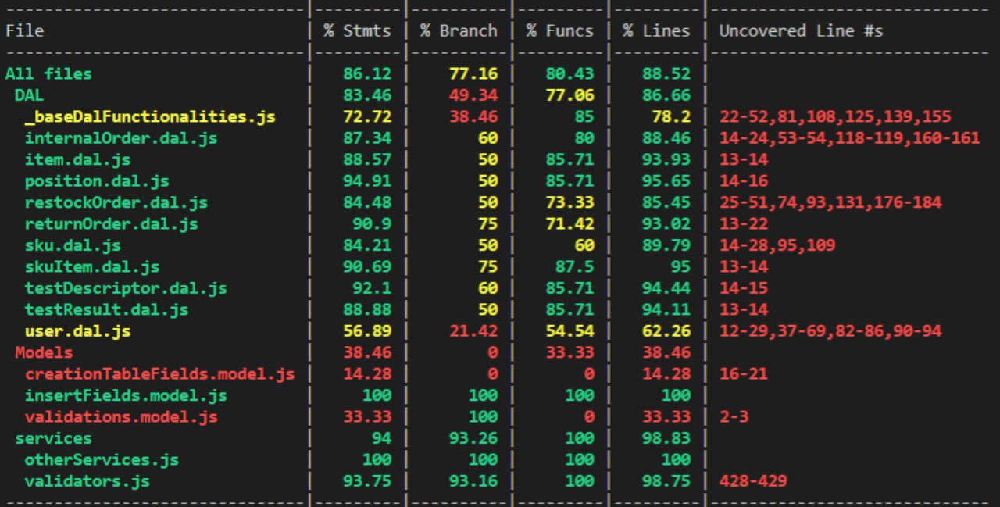

# Unit Testing Report

Date: 25/05/2022

Version: 1.0

# Contents

- [Black Box Unit Tests](#black-box-unit-tests)

- [White Box Unit Tests](#white-box-unit-tests)

# Black Box Unit Tests

    <Define here criteria, predicates and the combination of predicates for each function of each class.
    Define test cases to cover all equivalence classes and boundary conditions.
    In the table, report the description of the black box test case and (traceability) the correspondence with the Jest test case writing the 
    class and method name that contains the test case>
    <Jest tests  must be in code/server/unit_test  >

 ### **Class *validators* - method *idValidator***

**Criteria for method *idValidator*:**

 - If id exists
 - If id is an integer number
 - If id is positive

**Predicates for method *idValidator*:**

| Criteria | Predicate | |
| -------- | --------- |-|
| id exists | yes | no |
| id is an integer number | yes | no |
| id is positive | >= 0 | <0 |

**Boundaries**:

| Criteria | Boundary values |
| -------- | --------------- |
| id is positive | 0 |

**Combination of predicates**:

| id exists | id is an integer number | id is positive | Valid / Invalid | Description of the test case | Jest test case |
|-------|-------|-------|-------|-------|-------|
| yes | yes | yes | V |correct object|testIdValidator(1, true);|
|||no| I |negative id|testIdValidator(-1, false)|
||no|| I |id not a number|testIdValidator('2', false);|
|no| | | I |null id|testIdValidator(null, false);|

### **Class *validators* - method *isPositiveNumber***

**Criteria for method *isPositiveNumber*:**
 - string represent numeric value

**Predicates for method *isPositiveNumber*:**

| Criteria | Predicate | |
| -------- | --------- |-|
| is a digits sequence | yes | no |
| is a positive digits sequence | yes | no |

| Criteria | Boundary values |
| -------- | --------------- |
| stringValue is positive digits sequence | 0 |

**Combination of predicates**:

| is a digits sequence | is a positive digits sequence | Valid / Invalid | Description of the test case | Jest test case |
|-------|-------|-------|-------|-------|
| yes | yes | V |correct object|testIsPositiveNumber("1234", true);|
||no| I |represent negative number|testIsPositiveNumber("-12345", false)|
|no|| I |not all digits|testIsPositiveNumber("asdf1234", false);|

### **Class *validators* - method *isDate***

**Criteria for method *isDate*:**
-string exists
-string represent a date

**Predicates for method *isDate*:**

| Criteria | Predicate | |
| -------- | --------- |-|
| string exists | yes | no |
| string represents a date | yes | no |

| Criteria | Boundary values |
| -------- | --------------- |

**Combination of predicates**:

| exists | represents a date | Valid / Invalid | Description of the test case | Jest test case |
|-------|-------|-------|-------|------|
| yes | yes | V |correct object|testIsDate("2021/11/29 09:33", true);|
||no| I |not represent a date|testIsDate("asdfag", false);|
|no|| I |string is null|testIsDate(null, false);|

### **Class *validators* - method *rfidValidator***

**Criteria for method *rfidValidator*:**
- string exists
- string is 32 digit chars
- string represent positive number

**Predicates for method *rfidValidator*:**

| Criteria | Predicate | |
| -------- | --------- |-|
| string exists | yes | no |
| string is 32 digit chars | yes | no |
| string represent positive number | yes | no |

| Criteria | Boundary values |
| -------- | --------------- |
|string exists|null|
|string is 32 digit chars|31 digits|
||33 digits|

**Combination of predicates**:

| exists | is 32 digit chars |represent positive number| Valid / Invalid | Description of the test case | Jest test case |
|-------|-------|-------|-------|------|------|
|yes| yes | yes | V |correct object|testRfidValidator("01234567890123456789012345678901", true);|
|||no| I |represent negative number|testRfidValidator("-12345678901234567890123456789012", false);|
||no|| I |33 and 31 digit chars|testRfidValidator("012345678901234567890123456789012", false); testRfidValidator("0123456789012345678901234567890", false); |
|no||| I |null value|testRfidValidator(null, false);|

### **Class *validators* - method *positionIdValidators***

**Criteria for method *positionIdValidators*:**
- string exists
- string is 12 digit chars
- string represent positive number

**Predicates for method *positionIdValidators*:**

| Criteria | Predicate | |
| -------- | --------- |-|
| string exists | yes | no |
| string is 12 digit chars | yes | no |
| string represent positive number | yes | no |

| Criteria | Boundary values |
| -------- | --------------- |
|string exists|null|
|string is 12 digit chars|11 digits|
||13 digits|

**Combination of predicates**:

| exists | is 12 digit chars |represent positive number| Valid / Invalid | Description of the test case | Jest test case |
|-------|-------|-------|-------|------|------|
|yes| yes | yes | V | correct object |positionIdValidator("0123456789012", true);|
|||no| I | represent negative number|positionIdValidator("-12345678901", false);|
||no|| I | 13 and 11 digits |positionIdValidator("012345678901234567890123456789012", false); positionIdValidator("0123456789012345678901234567890", false); |
|no||| I |null value|positionIdValidator(null, false);|

### **Class *validators* - method *skuValidator***

**Criteria for method *skuValidator*:**
- description exists
- description is string
- weight is number
- weight is positive
- volume is a number
- volume is positive
- notes exist
- notes is a string
- availableQuantity is a number
- availableQuantity is positive
- price is a number
- price is positive

**Predicates for method *skuValidator*:**

| Criteria | Predicate | |
| -------- | --------- |-|
|description exists | yes | no |
|description is string| yes | no |
|weight is number| yes | no |
|weight is positive| >=0 | <0 |
|volume is a number| yes | no |
|volume is positive| >=0 | <0 |
|notes exist| yes | no |
|notes is a string| yes | no |
|availableQuantity is a number| yes | no |
|availableQuantity is positive| >=0 | <0 |
|price is a number| yes | no |
|price is positive| >=0 | <0 |

| Criteria | Boundary values |
| -------- | --------------- |
|weight is positive| 0 |
|volume is positive| 0 |
|availableQuantity is positive| 0 |
|price is positive| 0 |

**Combination of predicates**:

|description exists |description is string|weight is number|weight is positive|volume is a number|volume is positive|notes exist|notes is a string|availableQuantity is a number|availableQuantity is positive|price is a number|price is positive| Valid / Invalid | Description of the test case | Jest test case |
|----|----|----|----|----|----|----|----|----|----|----|----|----|----|----|
|yes|yes|yes|yes|yes|yes|yes|yes|yes|yes|yes|yes| V | correct object |testSkuValidator({"description": "a new sku","weight": 100,"volume": 50,"notes": "first SKU","price": 10.99,"availableQuantity": 50},false);|
||||||||||||no| I | price negative |testSkuValidator({"description": "a new sku","weight": 100,"volume": 50,"notes": "first SKU","price": -10.99,"availableQuantity": 50},false);|
|||||||||||no|| I | price is null |testSkuValidator({"description": "a new sku","weight": 100,"volume": 50,"notes": "first SKU","price": 10.99,"availableQuantity": 50},false);|
||||||||||no||| I | negative quantity |testSkuValidator({"description": "a new sku","weight": 100,"volume": 50,"notes": "first SKU","price": 10.99,"availableQuantity": -50},false);|
|||||||||no|||| I | quantity not a number |testSkuValidator({"description": "a new sku","weight": 100,"volume": 50,"notes": "first SKU","price": 10.99,"availableQuantity": "50"},false);|
||||||||no||||| I | notes are not a string |testSkuValidator({"description": "a new sku","weight": 100,"volume": 50,"notes": 1234,"price": 10.99,"availableQuantity": 50},false);|
|||||||no|||||| I | notes don't exist |testSkuValidator({"description": "a new sku","weight": 100,"volume": 50,"notes": null,"price": 10.99,"availableQuantity": 50},false);|
||||||no||||||| I | negative volume |testSkuValidator({"description": "a new sku","weight": 100,"volume": -50,"notes": "first SKU","price": 10.99,"availableQuantity": 50},false);|
|||||no|||||||| I | volume is a string |testSkuValidator({"description": "a new sku","weight": 100,"volume": "50","notes": "first SKU","price": 10.99,"availableQuantity": 50},false);|
||||no||||||||| I | negative weight |testSkuValidator({"description": "a new sku","weight": -100,"volume": "50","notes": "first SKU","price": 10.99,"availableQuantity": 50},false);|
|||no|||||||||| I | volume not a number |testSkuValidator({"description": "a new sku","weight": 100,"volume": "50","notes": "first SKU","price": 10.99,"availableQuantity": 50},false);|
||no||||||||||| I | description not a number |testSkuValidator({"description": 1234,"weight": 100,"volume": 50,"notes": "first SKU","price": 10.99,"availableQuantity": 50},false);|
|no|||||||||||| I | description doesn't exist | testSkuValidator({"description": null,"weight": 100,"volume": 50,"notes": "first SKU","price": 10.99,"availableQuantity": 50},false);|

### **Class *validators* - method *skuItemValidator***

**Criteria for method *skuItemValidator*:**
- rfid is ok
- id is ok
- date is ok

**Predicates for method *skuValidator*:**

| Criteria | Predicate | |
| -------- | --------- |-|
|rfid is ok | yes | no |
|id is ok| yes | no |
|date is ok| yes | no |

| Criteria | Boundary values |
| -------- | --------------- |

**Combination of predicates**:

|rfid is ok | id is ok | date is ok | Valid / Invalid | Description of the test case | Jest test case |
|----|----|----|----|----|----|
|yes|yes|yes| V | correct object | testSkuItemValidator({"RFID": "12345678901234567890123456789015","SKUId": 1,"DateOfStock": "2021/11/29 12:30"},true);|
|||no|I|not valid date|testSkuItemValidator({"RFID": "12345678901234567890123456789015","SKUId": 1,"DateOfStock": "kjhfhgjd"},false);|
||no||I|string id |testSkuItemValidator({"RFID": "12345678901234567890123456789015","SKUId": "1","DateOfStock": "2021/11/29 12:30"},false);|
|no|||I|not valid rfid (33 digits)|testSkuItemValidator({"RFID": "12345678901234567890123456789015","SKUId": 1,"DateOfStock": "2021/11/29 12:30"},false);|

### **Class *validators* - method *positionAddValidator***

**Criteria for method *positionAddValidator*:**
- rfid is ok
- id is ok
- date is ok

**Predicates for method *positionAddValidator*:**

| Criteria | Predicate | |
| -------- | --------- |-|
|id is ok| yes | no |
|aisleID exists| yes | no |
|aisleID is 4 chars long| yes | no |
|aisleID represents a positive number| yes | no |
|row exists| yes | no |
|row is 4 chars long| yes | no |
|row represents a positive number| yes | no |
|col exists| yes | no |
|col is 4 chars long| yes | no |
|col represents a positive number| yes | no |
|maxWeight is an integer number| yes | no |
|maxWeight is a positive number| >=0 | <0 |
|maxVolume is an integer number| yes | no |
|maxVolume is a positive number| >=0 | <0 |

| Criteria | Boundary values |
| -------- | --------------- |
|aisleID|3 chars long|
||5 chars long|
|row|3 chars long|
||5 chars long|
|col|3 chars long|
||5 chars long|
|maxWeight|0|
|maxVolume|0|

**Combination of predicates**:

|id is ok|aisleID exists|aisleID 4 chars long|aisleID positive number|row exists|row 4 chars long|row positive number|col exists|col 4 chars long|col positive number|maxWeight integer number|maxWeight positive number|maxVolume integer number|maxVolume positive number| Valid/Invalid| Description of the test case | Jest test case |
|----|----|----|----|----|----|----|----|----|----|----|----|----|----|----|----|----|
|yes|yes|yes|yes|yes|yes|yes|yes|yes|yes|yes|yes|yes|yes| V | correct object |testPositionAddValidator({"positionID":"800234543412","aisleID": "8002","row": "3454","col": "3412","maxWeight": 1000,"maxVolume": 1000},true);|
||||||||||||||no| I |negative maxVolume|testPositionAddValidator({"positionID":"800234543412","aisleID": "8002","row": "3454","col": "3412","maxWeight": 1000,"maxVolume": -1000},false);|
|||||||||||||no|| I |maxVolume not a number|testPositionAddValidator({"positionID":"800234543412","aisleID": "8002","row": "3454","col": "3412","maxWeight": 1000,"maxVolume": "1000"},false);|
||||||||||||no||| I |negative maxWeight|testPositionAddValidator({"positionID":"800234543412","aisleID": "8002","row": "3454","col": "3412","maxWeight": -1000,"maxVolume": 1000},false);|
|||||||||||no|||| I |maxWeight not a number|testPositionAddValidator({"positionID":"800234543412","aisleID": "8002","row": "3454","col": "3412","maxWeight": "1000","maxVolume": 1000},false);|
||||||||||no||||| I |negative col|testPositionAddValidator({"positionID":"800234543412","aisleID": "8002","row": "3454","col": "-412","maxWeight": 1000,"maxVolume": 1000},false);|
|||||||||no|||||| I |col not 4 chars long|testPositionAddValidator({"positionID":"800234543412","aisleID": "8002","row": "3454","col": "34132","maxWeight": 1000,"maxVolume": 1000},false);|
||||||||no||||||| I |col is null|testPositionAddValidator({"positionID":"800234543412","aisleID": "8002","row": "3454","col": null,"maxWeight": 1000,"maxVolume": 1000},false);|
|||||||no|||||||| I |negative row|testPositionAddValidator({"positionID":"800234543412","aisleID": "8002","row": "-454","col": "3412","maxWeight": 1000,"maxVolume": 1000},false);|
||||||no||||||||| I |row not 4 chars|testPositionAddValidator({"positionID":"800234543412","aisleID": "8002","row": "43454","col": "3412","maxWeight": 1000,"maxVolume": 1000},false);|
|||||no|||||||||| I |row is null|testPositionAddValidator({"positionID":"800234543412","aisleID": "8002","row": null,"col": "3412","maxWeight": 1000,"maxVolume": 1000},false);|
||||no||||||||||| I |negative aisleID|testPositionAddValidator({"positionID":"800234543412","aisleID": "-002","row": "3454","col": "3412","maxWeight": 1000,"maxVolume": 1000},false);|
|||no|||||||||||| I |aisleID not 4 chars long|testPositionAddValidator({"positionID":"800234543412","aisleID": "802","row": "3454","col": "3412","maxWeight": 1000,"maxVolume": 1000},false);|
||no||||||||||||| I |aisleId is null|testPositionAddValidator({"positionID":"800234543412","aisleID": null,"row": "3454","col": "3412","maxWeight": 1000,"maxVolume": 1000},false);|
|no|||||||||||||| I |positionId not valid|testPositionAddValidator({"positionID":"asdgf","aisleID": "8002","row": "3454","col": "3412","maxWeight": 1000,"maxVolume": 1000},false);|

### **Class *validators* - method *testDescriptorValidator***

**Criteria for method *testDescriptorValidator*:**
- name exist
- name is a string
- description exist
- description is a string
- idSKU is ok

**Predicates for method *testDescriptorValidatorw*:**

| Criteria | Predicate | |
| -------- | --------- |-|
| name exist | yes | no |
| name is a string | yes | no |
| description exist | yes | no |
| description is a string | yes | no |
| idSKU is ok | yes | no |

| Criteria | Boundary values |
| -------- | --------------- |

**Combination of predicates**:

| name exists | name is a string | description exists | description is a string | idSKU is ok | Valid / Invalid | Description of the test case | Jest test case |
|----|----|----|----|----|----|----|----|
|yes|yes|yes|yes|yes| V | correct object | testTestDescriptorValidator({"name":"test descriptor 3","procedureDescription":"This test is described by...","idSKU" :1},true);|
|||||no|I|isSKU string|testTestDescriptorValidator({"name":"test descriptor 3","procedureDescription":"This test is described by...","idSKU" :"1"},false);|
||||no||I|description is number|testTestDescriptorValidator({"name":"test descriptor 3","procedureDescription":12357869,"idSKU" :1},false);|
|||no|||I|procedure is null|testTestDescriptorValidator({"name":"test descriptor 3","procedureDescription":"null,"idSKU" :1},false);|
||no||||I|name is an object|testTestDescriptorValidator({"name":{description: "test descriptor 3"},"procedureDescription":"This test is described by...","idSKU" :1},false);|
|no|||||I|name is null|testTestDescriptorValidator({"name":null,"procedureDescription":"This test is described by...","idSKU" :1},false);|

### **Class *validators* - method *userAddValidator***

**Criteria for method *userAddValidator*:**
- username exists
- username is an email
- name exists
- name is a string
- surname exists
- surname is a string
- type exists
- type is acceptable
- password exists
- password is at least 8 chars

**Predicates for method *userAddValidator*:**

| Criteria | Predicate | |
| -------- | --------- |-|
| username exists | yes | no |
| username is an email | yes | no |
| name exists | yes | no |
| name is a string | yes | no |
| surname exists | yes | no |
| surname is a string | yes | no |
| type exists | yes | no |
| type is acceptable | yes | no |
| password exists | yes | no |
| password is at least 8 chars | yes | no |

| Criteria | Boundary values |
| -------- | --------------- |
| password | 7 chars |
| type | "manager"|

**Combination of predicates**:

| username exists | username is an email | name exists | name is a string | surname exists | surname is a string | type exists | type is acceptable | password exists | password is at least 8 chars | Valid / Invalid | Description of the test case | Jest test case |
|----|----|----|----|----|----|----|----|----|----|----|----|----|
|yes|yes|yes|yes|yes|yes|yes|yes|yes|yes| V | correct object | testUserAddValidator({"username":"user1@ezwh.com","name":"John","surname" : "Smith","password" : "testpassword","type" : "customer"},true);|
||||||||||no|I|password less than 8 chars|testUserAddValidator({"username":"user1@ezwh.com","name":"John","surname" : "Smith","password" : "test","type" : "customer"},false);|
|||||||||no||I|password is null|testUserAddValidator({"username":"user1@ezwh.com","name":"John","surname" : "Smith","password" : null,"type" : "customer"},false);|
||||||||no|||I|type is manager|testUserAddValidator({"username":"user1@ezwh.com","name":"John","surname" : "Smith","password" : "testpassword","type" : "manager"},false);|
|||||||no||||I|type is null|testUserAddValidator({"username":"user1@ezwh.com","name":"John","surname" : "Smith","password" : "testpassword","type" : ull},false);|
||||||no|||||I|surname is a number|testUserAddValidator({"username":"user1@ezwh.com","name":"John","surname" : 1234,"password" : "testpassword","type" : "customer"},false);|
|||||no||||||I|surname is null|testUserAddValidator({"username":"user1@ezwh.com","name":"John","surname" : null,"password" : "testpassword","type" : "customer"},false);|
||||no|||||||I|name is a number|testUserAddValidator({"username":"user1@ezwh.com","name":1234,"surname" : "Smith","password" : "testpassword","type" : "customer"},false);|
|||no||||||||I|name is null|testUserAddValidator({"username":"user1@ezwh.com","name": null,"surname" : "Smith","password" : "testpassword","type" : "customer"},false);|
||no|||||||||I|username is not an email|testUserAddValidator({"username":"user1ezwh.com","name":"John","surname" : "Smith","password" : "testpassword","type" : "customer"},false);|
|no||||||||||I|username is null|testUserAddValidator({"username":null,"name":"John","surname" : "Smith","password" : "testpassword","type" : "customer"},false);|

### **Class *validators* - method *restockOrderValidator***

**Criteria for method *restockOrderValidator*:**
- issueDate exist
- issueDate is a date
- products exist
- products is not null
- product are all ok
- supplierId is ok

**Predicates for method *restockOrderValidator*:**

| Criteria | Predicate | |
| -------- | --------- |-|
| issueDate exist | yes | no |
| issueDate is a date | yes | no |
| products exist | yes | no |
| products is not empty | yes | no |
| product are all ok | yes | no |
| supplierId is ok | yes | no |

| Criteria | Boundary values |
| -------- | --------------- |

**Combination of predicates**:

| issueDate exists | issueDate is a date | products exists | products is not empty | product are all ok | supplierId is ok | Valid / Invalid | Description of the test case | Jest test case |
|----|----|----|----|----|----|----|----|----|
|yes|yes|yes|yes|yes|yes| V | correct object | testRestockOrderValidator({"issueDate": "2021/11/29 09:33","products": [{ "SKUId": 12, "description": "a product", "price": 10.99, "qty": 3 },{ "SKUId": 180, "description": "another product", "price": 11.99, "qty": 3 }],"supplierId": 1},true);|
||||||no|I|supplierId is string|testRestockOrderValidator({"issueDate": "2021/11/29 09:33","products": [{ "SKUId": 12, "description": "a product", "price": 10.99, "qty": 3 },{ "SKUId": 180, "description": "another product", "price": 11.99, "qty": 3 }],"supplierId": "1"},false);|
|||||no||I|first product fail: description null|testRestockOrderValidator({"issueDate": "2021/11/29 09:33","products": [{ "SKUId": 12, "description": null, "price": 10.99, "qty": 3 },{ "SKUId": 180, "description": "another product", "price": 11.99, "qty": 3 }],"supplierId": 1},false);|
||||no|||I|products is empty|testRestockOrderValidator({"issueDate": "2021/11/29 09:33","products": [],"supplierId": 1},false);|
|||no||||I|products not exist|testRestockOrderValidator({"issueDate": "2021/11/29 09:33","products": null,"supplierId": 1},false);|
||no|||||I|issueDate is not a date|testRestockOrderValidator({"issueDate": "asdgh","products": [{ "SKUId": 12, "description": "a product", "price": 10.99, "qty": 3 },{ "SKUId": 180, "description": "another product", "price": 11.99, "qty": 3 }],"supplierId": 1},false);|
|no||||||I|issueDate is null|testRestockOrderValidator({"issueDate": null,"products": [{ "SKUId": 12, "description": "a product", "price": 10.99, "qty": 3 },{ "SKUId": 180, "description": "another product", "price": 11.99, "qty": 3 }],"supplierId": 1},false);|

### **Class *validators* - method *returnOrderValidator***

**Criteria for method *returnOrderValidator*:**
- returnDate is a date
- products exist
- products is not empty
- products are all ok
- restockOrderId is ok

**Predicates for method *returnOrderValidator*:**

| Criteria | Predicate | |
| -------- | --------- |-|
| returnDate is a date | yes | no |
| products exist | yes | no |
| products is not empty | yes | no |
| products are all ok | yes | no |
| restockOrderId is ok | yes | no |

| Criteria | Boundary values |
| -------- | --------------- |
| products | [] |

**Combination of predicates**:

| returnDate is a date | products exist | products is not empty | products are all ok | restockOrderId is ok | Valid / Invalid | Description of the test case | Jest test case |
|----|----|----|----|----|----|----|----|
|yes|yes|yes|yes|yes| V | correct object | testReturnOrderValidator({"returnDate":"2021/11/29 09:33","products": [{"SKUId":12,"description":"a product","price":10.99,"RFID":"12345678901234567890123456789016"},{"SKUId":180,"description":"another product","price":11.99,"RFID":"12345678901234567890123456789038"}],"restockOrderId" : 1},true);|
|||||no|I|restockOrderId is null| testReturnOrderValidator({"returnDate":"2021/11/29 09:33","products": [{"SKUId":12,"description":"a product","price":10.99,"RFID":"12345678901234567890123456789016"},{"SKUId":180,"description":"another product","price":11.99,"RFID":"12345678901234567890123456789038"}],"restockOrderId" : null},false);|
||||no||I|second products has null SKUId| testReturnOrderValidator({"returnDate":"2021/11/29 09:33","products": [{"SKUId":12,"description":"a product","price":10.99,"RFID":"12345678901234567890123456789016"},{"SKUId":null,"description":"another product","price":11.99,"RFID":"12345678901234567890123456789038"}],"restockOrderId" : 1},false);|
|||no|||I|products is empty| testReturnOrderValidator({"returnDate":"2021/11/29 09:33","products": [],"restockOrderId" : 1},false);|
||no||||I|products is null| testReturnOrderValidator({"returnDate":"2021/11/29 09:33","products": null"restockOrderId" : 1},false);|
|no|||||I|returnDate is not a valid Date | testReturnOrderValidator({"returnDate":"2021/17/29 09:33","products": [{"SKUId":12,"description":"a product","price":10.99,"RFID":"12345678901234567890123456789016"},{"SKUId":180,"description":"another product","price":11.99,"RFID":"12345678901234567890123456789038"}],"restockOrderId" : 1},false);|

### **Class *validators* - method *internalOrderValidator***

**Criteria for method *internalOrderValidator*:**
- issueDate exist
- issueDate is a date
- products exist
- products is not null
- product are all ok
- customerId is ok

**Predicates for method *interalOrderValidator*:**

| Criteria | Predicate | |
| -------- | --------- |-|
| issueDate exist | yes | no |
| issueDate is a date | yes | no |
| products exist | yes | no |
| products is not empty | yes | no |
| product are all ok | yes | no |
| customerId is ok | yes | no |

| Criteria | Boundary values |
| -------- | --------------- |

**Combination of predicates**:

| issueDate exists | issueDate is a date | products exists | products is not empty | product are all ok | customerId is ok | Valid / Invalid | Description of the test case | Jest test case |
|----|----|----|----|----|----|----|----|----|
|yes|yes|yes|yes|yes|yes| V | correct object | testInternalOrderValidator({"issueDate":"2021/11/29 09:33",products": [{"SKUId":12,"description":"a product","price":10.99,"qty":3},{"SKUId":180,"description":"another product","price":11.99,"qty":3}],"customerId" : 1},true);|
||||||no|I|customerId is string|testInternalOrderValidator({"issueDate":"2021/11/29 09:33",products": [{"SKUId":12,"description":"a product","price":10.99,"qty":3},{"SKUId":180,"description":"another product","price":11.99,"qty":3}],"customerId" : "1"},false);|
|||||no||I|first product fail: description null|testInternalOrderValidator({"issueDate":"2021/11/29 09:33",products": [{"SKUId":12,"description":null,"price":10.99,"qty":3},{"SKUId":180,"description":"another product","price":11.99,"qty":3}],"customerId" : 1},false);|
||||no|||I|products is empty|testInternalOrderValidator({"issueDate": "2021/11/29 09:33","products": [],"customerId": 1},false);|
|||no||||I|products not exist|testInternalOrderValidator({"issueDate": "2021/11/29 09:33","products": null,"customerId": 1},false);|
||no|||||I|issueDate is not a date|testInternalOrderValidator({"issueDate": "asdgh","products": [{"SKUId":12,"description":"a product","price":10.99,"qty":3},{"SKUId":180,"description":"another product","price":11.99,"qty":3}],"customerId": 1},false);|
|no||||||I|issueDate is null|testInternalOrderValidator({"issueDate": null,"products": [{ "SKUId": 12, "description": "a product", "price": 10.99, "qty": 3 },{ "SKUId": 180, "description": "another product", "price": 11.99, "qty": 3 }],"customerId": 1},false);|

# White Box Unit Tests

### Test cases definition
    
    
    <Report here all the created Jest test cases, and the units/classes under test >
    <For traceability write the class and method name that contains the test case>

| Unit name | Jest test case |
|--|--|
| internalOrder.dal | internalOrderDAL.test |
| item.dal | itemDAL.test |
| position.dal | positionDAL.test |
| restockOrder.dal | restockOrderDAL.test |
| returnOrder.dal | returnOrderDAL.test |
| sku.dal | skuDAL.test |
| skuItem.dal | skuItemDAL.test |
| testDescriptor.dal | testDescriptorDAL.test |
| testResult.dal | testResultDAL.test |
| user.dal | userDAL.test |

### Code coverage report

    <Add here the screenshot report of the statement and branch coverage obtained using
    the coverage tool. >

    

### Loop coverage analysis

    <Identify significant loops in the units and reports the test cases
    developed to cover zero, one or multiple iterations >

| Unit name | Loop rows | Number of iterations | Jest test case |
|---|---|---|---|
| internalOrderDAL.test | 47 - 59  | 1 | internalOrder.DAL.getAll |
| internalOrderDAL.test | 73 - 81  | 1 | internalOrder.DAL.getAllIssued |
| internalOrderDAL.test | 95 - 103 | 1 | internalOrder.DAL.getAllAccepted |
| internalOrderDAL.test | 109 / 122 | > 1 | internalOrder.DAL.getById |
| internalOrderDAL.test | 161 | > 1 | internalOrder.DAL.update |
| internalOrderDAL.test | 174 | > 1 | internalOrder.DAL.delete |
| restockOrderDAL.test  | 78 - 101  | > 1 | restockOrder.DAL.getAll |
| restockOrderDAL.test | 117 - 139  | > 1 | restockOrder.DAL.getAllIssued |
| restockOrderDAL.test | 153 | > 1 | restockOrder.DAL.getById |
| restockOrderDAL.test | 177 - 185 | > 1 | restockOrder.DAL.getReturned |
| restockOrderDAL.test | 201 - 206 | > 1 | restockOrder.DAL.add |
| restockOrderDAL.test | 225 - 228 | > 1 | restockOrder.DAL.addSkuItems |
| restockOrderDAL.test | 252 / 257 / 263 | > 1 / 0 / > 1 | restockOrder.DAL.delete |
| returnOrderDAL.test | 41 - 50  | > 1 | returnOrder.DAL.getAll |
| returnOrderDAL.test | 62 - 67 | > 1 | returnOrder.DAL.getById |
| returnOrderDAL.test | 85 - 90 | > 1 | returnOrder.DAL.add |
| returnOrderDAL.test | 105 | > 1 | returnOrder.DAL.delete |
| skuDAL.test         | 44 | > 1 | sku.DAL.getAll |
| skuDAL.test         | 62 | > 1 | sku.DAL.getBy |
| skuDAL.test         | 95 | 1 | sku.DAL.remove |